# Tagtools vignettes: overview and introduction

Welcome to TagTools! On behalf of the team who developed this website
and these software tools, thanks for checking out our project—we hope
you’re doing well.

These webpages are called *vignettes*, which means they can run in R
directly. Each page is designed to teach you how to use a few functions
together to accomplish usually a single task, or a short set of
interrelated tasks. All of them might be helpful to you as you learn and
work in biologging.

In this page, you will be quickly introduced to each of the vignettes
included in the package, so that you might be able to get a sense for
which would be helpful to you today. They are presented in a suggested
order. More help is generally provided in the vignettes earlier in
sequence, and more independence is generally required in some of the
later ones.

*Estimated time to read this vignette: 20 minutes.*

## More background: What’s in a Vignette?

Already familiar with the concept? Feel free to skip down to
[Introductory vignettes](#introductory-vignettes)!

A vignette contains various chunks of information one after the other,
including plain text chunks (like this one), code chunks, and—especially
in this package—collapsible answers and results sections. These are
really plain text chunks and code chunks running directly with some HTML
code to make them easily hidden by default, then openable with a click
of a button.

Here is an example of a code chunk. Click “Code” below right to expand
it.

``` r
# This is a code chunk!
print("Hello, Biologger!")
print(sqrt(256))
yData <- sin(c(1:24)*pi/12)
plot(x = c(1:length(yData)), y = yData, xlab = "X", ylab = "sin(π/12 X)")
```

In this package, we often include the results of a given code chunk
directly after the code chunk, especially if there is some interesting
visible result. The code above is an example of that, so let’s see some
results.

Show/Hide Results

    #> [1] "Hello, Biologger!"
    #> [1] 16


All code provided in vignettes that are presented this way should run
smoothly. The code has been checked quite a few times for bugs,
including every time that the package is built using the following
command:

``` r
devtools::install_github('stacyderuiter/TagTools/R/tagtools', build_vignettes = TRUE)
```

## Introductory vignettes

If you’re new to the package, these vignettes are for you! Anyone could
benefit from reviewing some of the basics of making sure the package is
loaded correctly, loading data, converting between (sensor) data
structures and vectors, and using our plotter function, `plott`.

### *0. Overview (this vignette!)*

### 1. install-load-tagtools

`vignette('install-load-tagtools')`

*Estimated time to complete: 15 minutes.*

This vignette is especially helpful for the very new users who haven’t
yet installed tagtools. A couple of different options for installation
are given, with some helpful information as to how to interpret the
messages R sends as you are installing. For example, did you know that
getting a lot of red messages in a row isn’t always a bad thing (in
fact, during package install, it can mean everything is running
smoothly)?

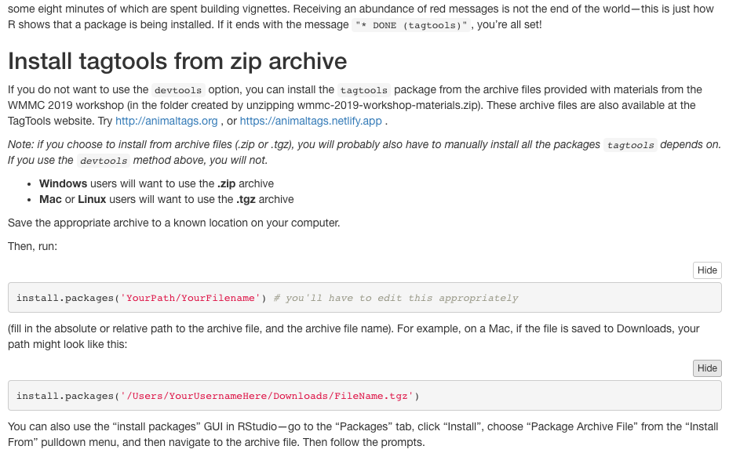

### 2. load-tag-data

`vignette('load-tag-data')`

*Estimated time to complete: 20 minutes.*

This vignette deals with the functions `load_nc`, `add_nc`, and
`save_nc`, which form the backbone of dealing with data from NetCDF
files. In particular, you’ll use `load_nc` in every vignette after this
one. By doing this vignette, you will learn a couple of different ways
to load in data, which is particularly important if you’re finding your
data somewhere other than the tagtools package (with its eight built-in
datasets). You’ll also learn to add and edit metadata—important data
about the data.

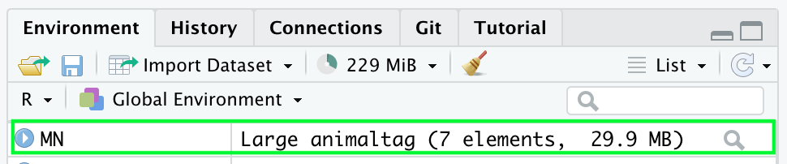

### 3. vectors-vs-structures

`vignette('vectors-vs-structures')`

*Estimated time to complete: 15 minutes.*

This quick vignette talks about the differences between vectors
(scalars, matrices—all standalone objects) and data structures (which
contain more than one object). Particularly important to understand is
the `$` operator, used extensively in R with our datasets. For instance,
the acceleration data of a dataset called `bw`, for `beaked_whale`,
might be found under `bw$A`.

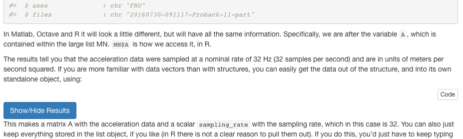

### 4. plots-and-cropping

`vignette('plots-and-cropping')`

*Estimated time to complete: 25 minutes.*

This is the first vignette for which we can include a really compelling
graphic to lure you to try it! You’ll learn to use the tagtools plotter
function `plott`, and crop some irrelevant data (at the beginning and
end of a recording) out, allowing you to plot just the data that was
actually from an animal.

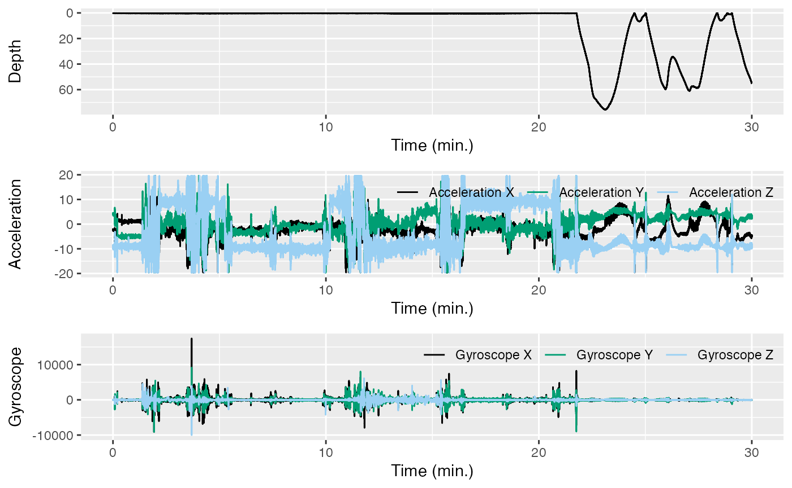

## Calibration

### 1. data-quality-error-correction

`vignette('data-quality-error-correction')`

*Estimated time to complete: 25 minutes.*

You’ll find some common sources of error in accelerometer and
magnetometer data, and see some ways that these errors can be corrected.
Quality checking is fairly easy for pressure (depth) data from aquatic
mammals because we know they will breathe at the surface. Data from
accelerometers and magnetometers are more difficult. For one thing,
there are three axes, and also we don’t have such an intuitive feel for
what they should look like. However, fortunately, there are some quality
checks we can do with `A` and `M` data that help to catch and correct
problems.

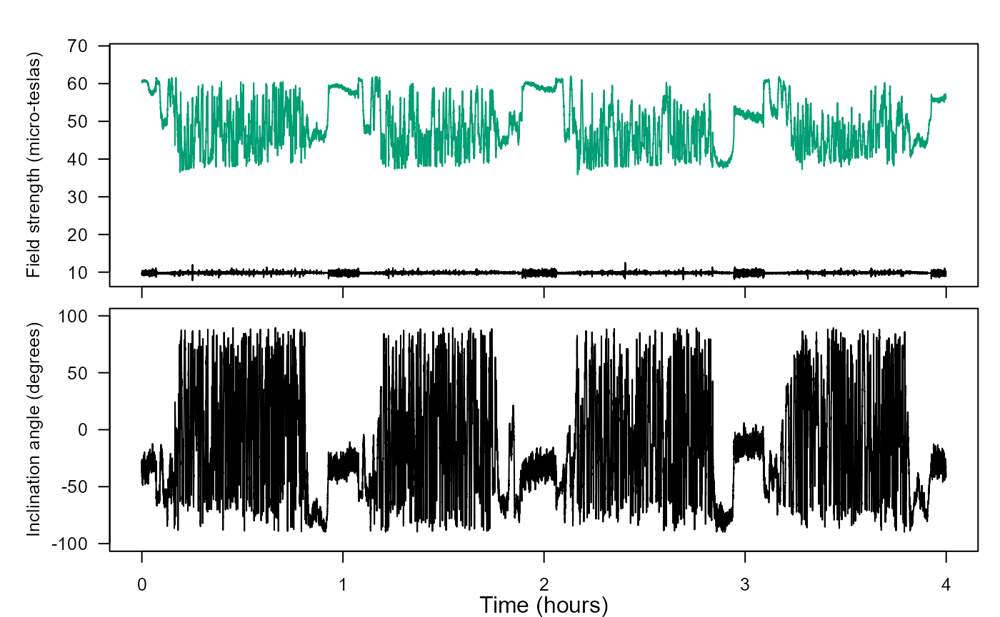

### 2. tag-to-whale-frame

`vignette('tag-to-whale-frame')`

*Estimated time to complete: 25 minutes.*

You’ll correct data that was not oriented properly into the animal’s
frame of reference. For tags placed on free-swimming animals, the tag
axes will not generally coincide with the animal’s axes. The tag `A` and
`M` data will therefore tell you how the tag, not the animal, is
oriented. This can be corrected if you know the orientation of the tag
on the animal (the pitch, roll and heading of the tag when the animal is
horizontal and pointing north). Three steps are needed to do this: First
the tag orientation on the whale is inferred by looking at accelerometer
values when the animal is near the surface. The orientation may change
if the tag moves or slides during a deployment and so we make an
‘orientation table’ that describes the sequence of orientations of the
tag. This table is then used to convert tag frame measurements into
animal frame.

## Filtering

These three vignettes are particularly interrelated, so we do recommend
doing them together. Each has to do with applying some sort of a filter
(e.g. high-pass filtering, low-pass filtering) to gain more insight from
data (e.g. acceleration or magnetometer).

### 1. acceleration-filtering

`vignette('acceleration-filtering')`

*Estimated time to complete: 20 minutes.*

You’ll use complementary filters on acceleration data taken from a
beaked whale. This will separate intervals of movements into distinct
frequency bands, i.e., posture (low frequency) and strikes/flinches
(high frequency), in order to gain insight about the movements of the
animal.

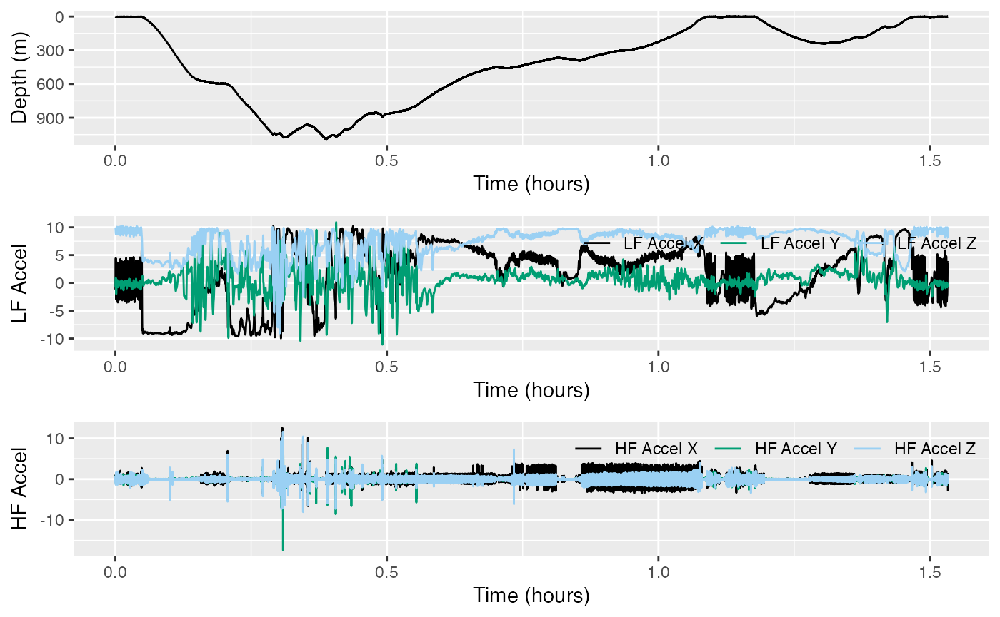

### 2. jerk-transients

`vignette('jerk-transients')`

*Estimated time to complete: 20 minutes.*

We work with acceleration data all the time, and you know acceleration
is the second derivative of position. Take a third derivative and you’ll
have what is called the jerk, which can be used effectively as a
high-pass filter. This will also illuminate the particular value of
having high-resolution data (especially data with a lot of
high-frequency content).

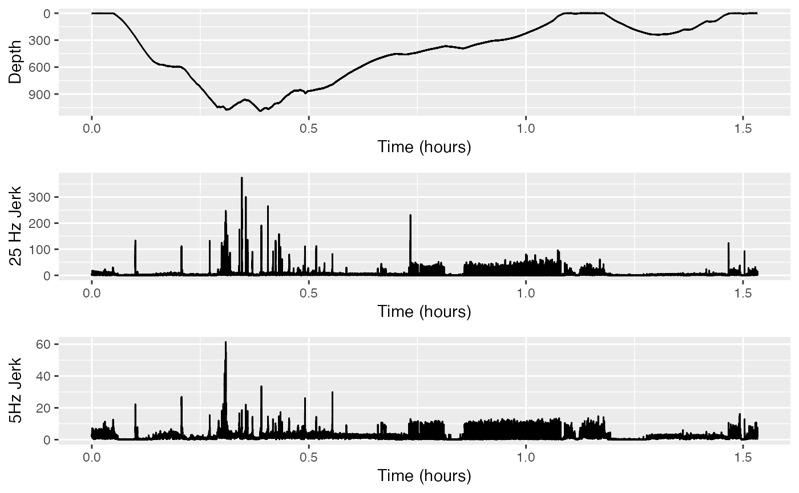

### 3. magnetometer-filtering

`vignette('magnetometer-filtering')`

*Estimated time to complete: 20 minutes.*

You’ll use the same techniques from `acceleration-filtering`, but on
magnetometer data.

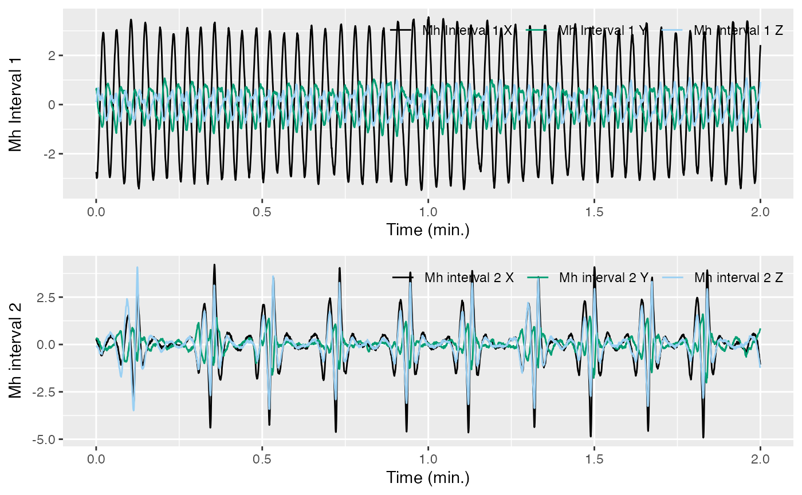

## Advanced processing

These vignettes are a bit of a hodge-podge: all things that you can do
now once you have some experience working with the `tagtools` package.
Slightly less guidance is given, and slightly more independence is
expected/required.

### 1. fine-scale-tracking

`vignette('fine-scale-tracking')`

*Estimated time to complete: 40 minutes.*

This is a longer vignette—not shortened from the older practical. You
will dead-reckon the travel path of an animal based on estimates of
forward speed… and without any knowledge of currents (thus, an estimate
of where the animal might have traveled relative to an object “dead in
the water”). Large errors result. But with the help of some correction,
a more full picture of animal movement can emerge, as compared to what
we could have gathered simply using GPS data.

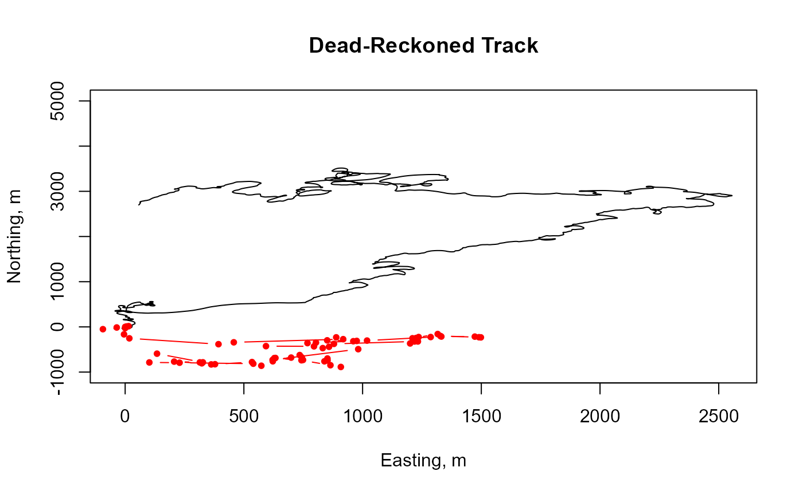

### 2. find-dives

`vignette('find-dives')`

*Estimated time to complete: 20 mins*

This vignette starts with a quick review, where you’ll find and correct
for a few different sources of error in some depth data. Then, you’ll
locate the beginnings and endings of dives, and plot these beginnings
and endings on a depth profile using the function `find_dives`. You’ll
also do some simple analysis, like calculating the mean dive depth.

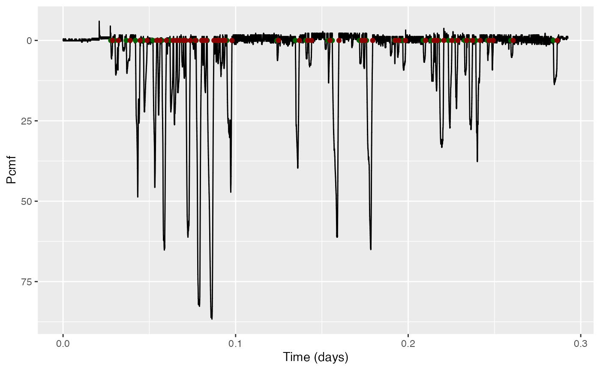

### 3. dive-stats

`vignette('dive-stats')`

*Estimated time to complete: 25 mins*

This vignette also has a nice review of some previous concepts—cropping
data, calibrating data, and then finding dives. After that, you’ll use
the function `dive_stats` to efficiently compute summary statistics on
dives from a depth profile.

    #>   num       max      st      et    dur dest_st dest_et dest_dur to_dur from_dur
    #> 1   1 1737.0414  6728.0 10805.8 4077.8  7698.2  8953.6   1255.4  970.2   1852.4
    #> 2   2  356.2372 10925.0 12510.4 1585.4 11211.6 11802.0    590.4  286.6    708.6
    #> 3   3  395.3293 12623.6 14229.6 1606.0 13092.8 13704.6    611.8  469.2    525.2
    #> 4   4  390.7887 14303.6 16091.0 1787.4 14768.4 15391.0    622.6  464.8    700.2
    #> 5   5  437.5752 16177.2 18026.8 1849.6 16636.4 17170.0    533.6  459.2    857.0
    #> 6   6  365.1476 18088.0 20000.2 1912.2 18572.0 19160.8    588.8  484.0    839.6
    #>     to_rate  from_rate
    #> 1 1.5208853 -0.7970521
    #> 2 1.0548637 -0.4260587
    #> 3 0.7149649 -0.6382696
    #> 4 0.7144625 -0.4733356
    #> 5 0.8086120 -0.4336557
    #> 6 0.6405371 -0.3693056

### 4. rotation-test

`vignette('rotation-test')`

*Estimated time to complete: 20 mins*

You’ll use a statistical method to test whether a hypothesis holds up
under scrutiny, using a dataset from(?) a beloved lake creature. It’s
nice to do this one after `find-dives`, since you’ll use similar
techniques from this one.

    #> $result
    #>   statistic CI_low CI_up n_rot conf_level   p_value
    #> 1       153      0   862 10000       0.95 0.7333267

### 5. mahalanobis-distance

`vignette('mahalanobis-distance')`

*Estimated time to complete: 25 mins*

You’ll compare data to other data to see how out of the ordinary it is,
using a dataset from a whale that underwent controlled exposure to
military sonar.

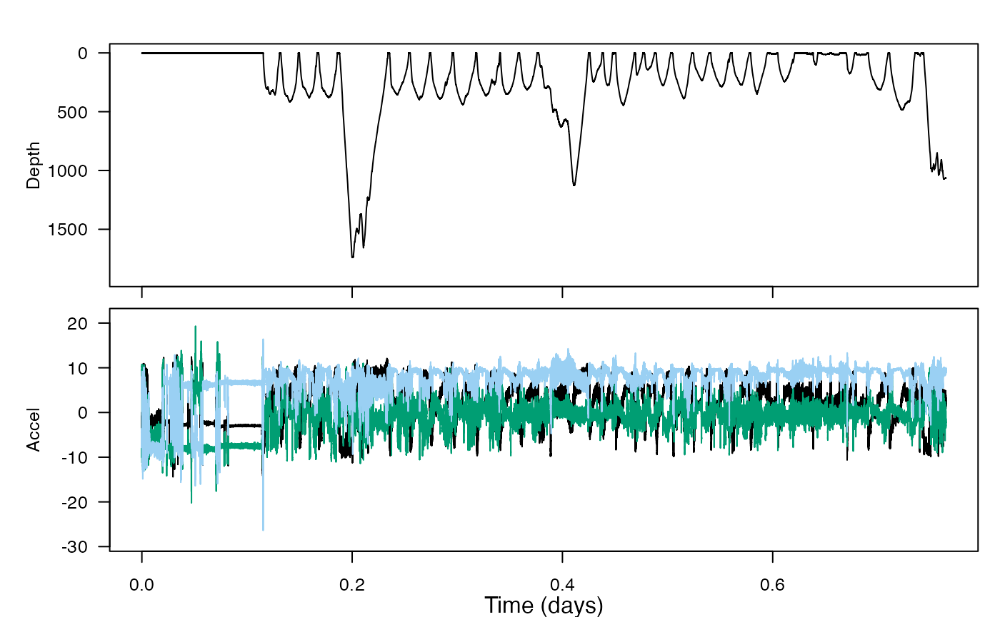

## Miscellaneous

The `Detectors` (and `detectors-draft`) vignette deal with the function
`detect_peaks`. They lack some of the newer features in the other
vignettes (hideable results, answers), but are worth trying
nevertheless.

## Conclusion

Thanks for reading—best of luck!

------------------------------------------------------------------------

Animaltags tag tools online: <http://animaltags.org/>,
<https://github.com/animaltags/tagtools_r> (for latest beta source
code), <https://animaltags.github.io/tagtools_r/index.html> (vignettes
overview)
