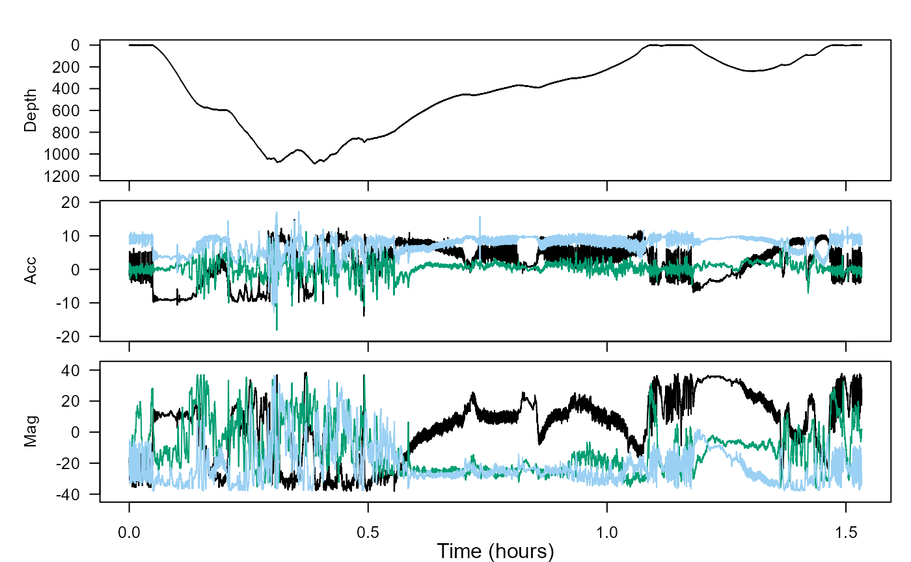
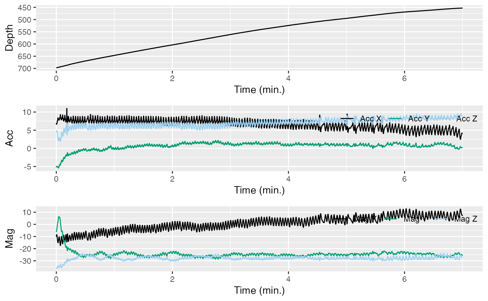
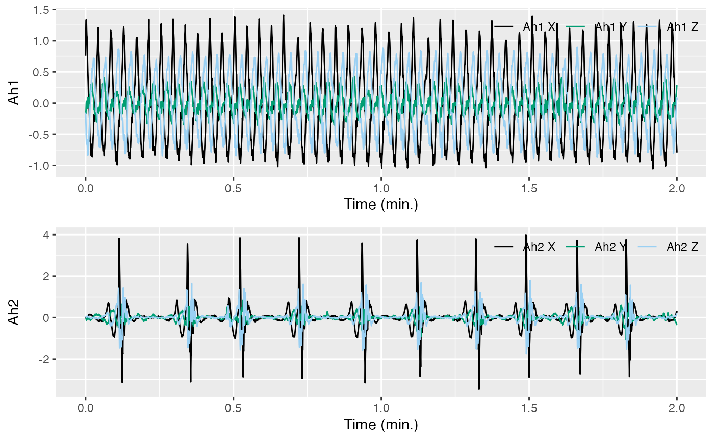
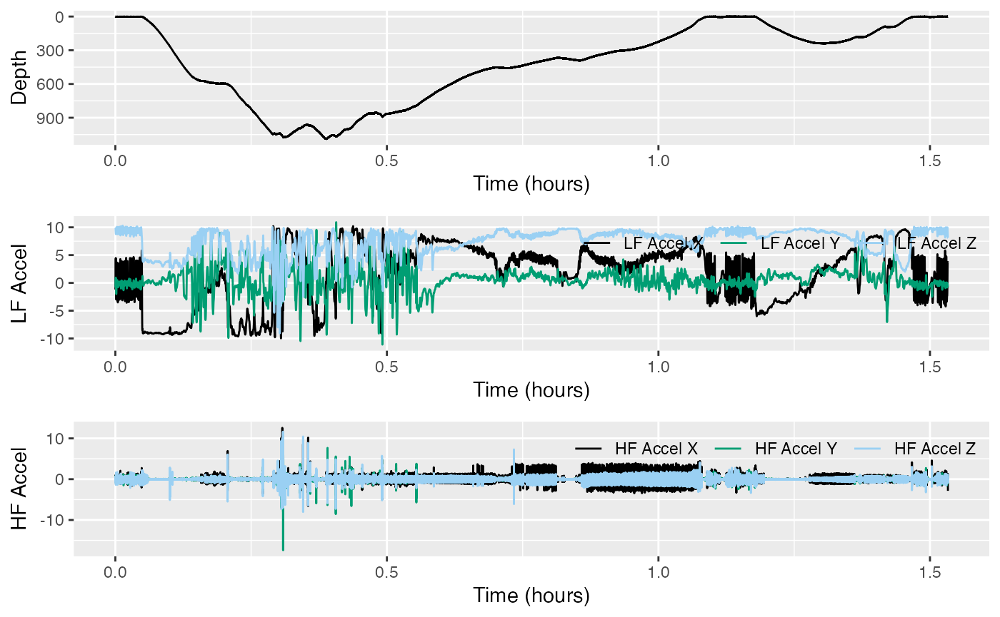
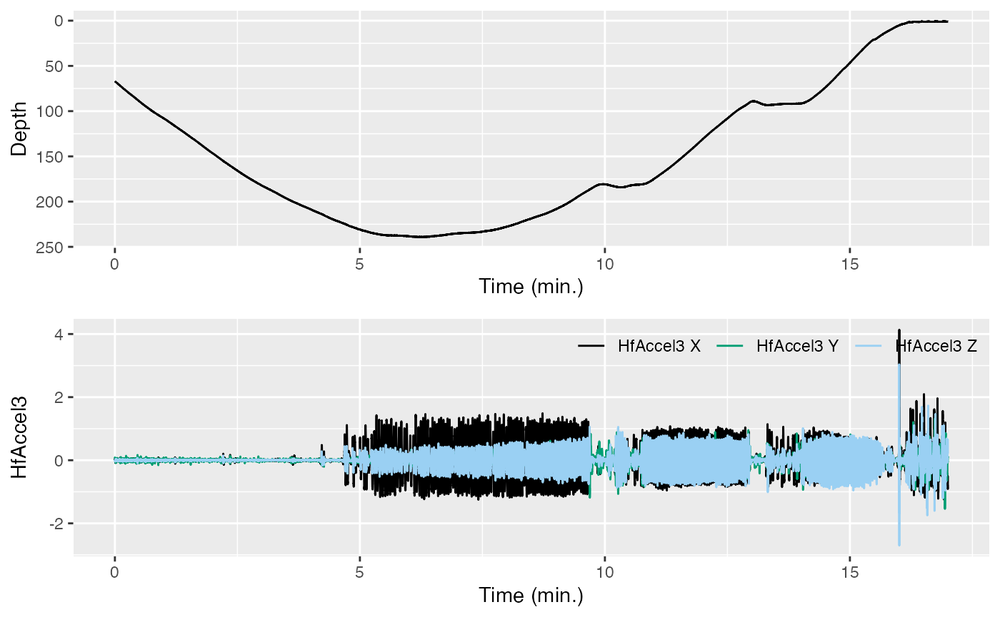
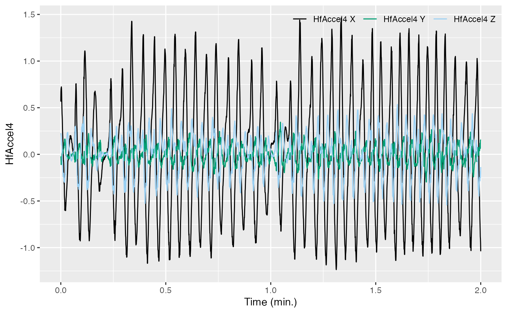
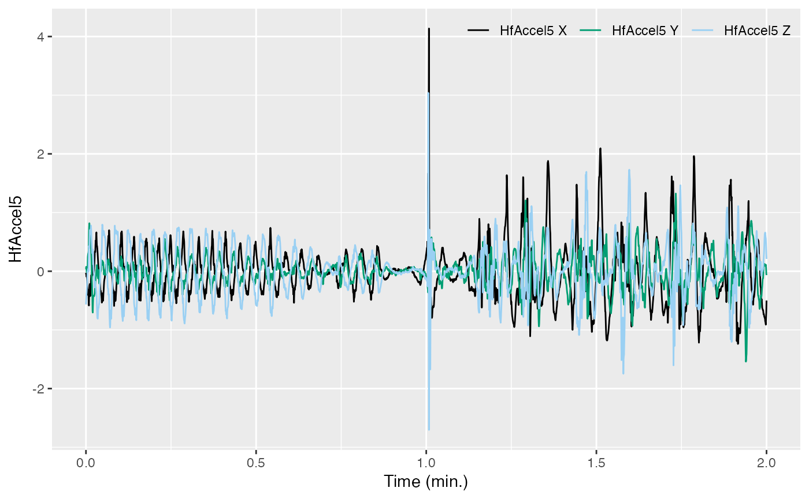

# Complementary filtering for acceleration: low- & high-frequency

Welcome to the `acceleration-filtering` vignette! Thanks for taking some
time to learn our package; we hope it’s, thus far, all you’ve dreamed it
would be.

In this vignette, you will explore postural dynamics and specific
acceleration in the time and frequency domains. Specifically, you’ll
load in some new data and use complementary filters to separate
intervals of movements into distinct frequency bands, i.e., posture (low
frequency) and strikes/flinches (high frequency), in order to gain
insight about the movements of a beaked whale.

*Estimated time for this practical: 20 minutes.*

These vignettes all assume that you have R/Rstudio installed on your
machine, some basic experience working with them, and can execute
provided code, making some user-specific changes along the way (e.g. to
help R find a file you downloaded). We will provide you with quite a few
lines. To boost your own learning, you would do well to try and write
them before opening what we give, using this just to check your work.

Additionally, be careful when copy-pasting special characters such as
\_underscores\_ and ‘quotes’. If you get an error, one thing to check is
that you have just a single, simple underscore, and `'straight quotes'`,
whether `'single'` or `"double"` (rather than “smart quotes”).

## Setup

For this vignette we will use data from a suction cup tag attached to
the back of a beaked whale. If you want to run this example, download
the “testset1.nc” file from
<https://github.com/animaltags/tagtools_data> and change the file path
to match where you’ve saved the files

Write `testset1` to the object `bw`, for “beaked whale”. Then use
[`plott()`](https://animaltags.github.io/tagtools_r/reference/plott.md)
to inspect it.

``` r
library(tagtools)
bw_file_path <- "nc_files/testset1.nc"
bw <- load_nc(bw_file_path)
plott(X = list(Depth = bw$P, Acc = bw$A, Mag = bw$M))
```

Show/Hide Results



This dataset contains a deep dive followed by a shallow dive. We want to
infer the function of these by looking for locomotion effort and sudden
changes in acceleration that could be indicative of prey capture
attempts. We are also going to look for changes in swimming gait.

## Complementary filtering

To separate slow orientation changes from postural dynamics in
locomotion, we need to choose a filter cut-off frequency below the
stroke frequency. We can estimate the dominant stroke frequency using
[`dsf()`](https://animaltags.github.io/tagtools_r/reference/dsf.md).
There is a bout of steady swimming between minutes 35 and 42 in the
data. Use
[`crop_to()`](https://animaltags.github.io/tagtools_r/reference/crop_to.md)
to pick out the accelerometer data in that interval:

``` r
Aseg <- crop_to(X = bw$A, tcues = c(35*60, 42*60))
```

Mimic the previous code to similarly crop the pressure (depth) and
magnetometer data:

``` r
Dseg <- crop_to(X = bw$P, tcues = c(35*60, 42*60))
Mseg <- crop_to(X = bw$M, tcues = c(35*60, 42*60))
```

Plot the three of them together to make sure you got it right.

``` r
plott(X = list(Depth = Dseg, Acc = Aseg, Mag = Mseg), interactive = TRUE)
```

Show/Hide Results



Then, run
[`dsf()`](https://animaltags.github.io/tagtools_r/reference/dsf.md) on
`Aseg` to get the mean stroking rate:

``` r
dsfa <- dsf(Aseg)$fpk   # estimated stroking rate in Hz
```

Try doing the same with the magnetometer data:

``` r
dsfm <- dsf(Mseg)$fpk # another estimate
```

Are the estimated stroke rates similar?

*Show/Hide Answer*

*Yes, they should be. The acceleration-based estimate is .3821574, and
the magnetometer-based estimate is .3807932.*

The magnetometer is not sensitive to specific acceleration, so why do
stroking motions show up in `Mseg`?

*Show/Hide Answer*

*The animal is changing its position, so the magnetometer reading will
change.*

Refer to your plots of `Mseg` and `Dseg` to try and figure out which
axis the stroking motions show up in.

A good starting choice for the filter cut-off frequency is 70% of the
stroking rate (pick one of the estimates, or average the two). Call this
value `fc`. Run a complementary filter on `A` to separate the slow and
fast time-scales. Recall that `A` is stored under `bw` as `bw$A`:

``` r
fc <- 'YourValueHere'           # your value for fc in Hz, a number, without quotes
Af <- comp_filt(bw$A, fc = fc) 
str(Af, max.level = 1) 
```

Show/Hide Results

    #> List of 2
    #>  $ lowpass : num [1:137976, 1:3] -1.23 -1.22 -1.21 -1.2 -1.17 ...
    #>  $ highpass: num [1:137976, 1:3] -0.621 -0.555 -0.513 -0.508 -0.468 ...

The complementary filter returns a list containing two data matrices:
the low-pass filtered data and the high-pass filtered data. Each of
these is a three-column matrix because the filter is run on each column
of the input data. So it is like you now have two accelerometers in the
tag—one is only sensitive to low frequencies and the other is only
sensitive to high frequencies. If you would like to get each matrix out
of the cell array, do:

``` r
Alow <- Af[[1]]     # low frequency A data
Ahigh <- Af[[2]]      # high frequency A data
```

The sampling rate of these is the same as for the original data. For
simplicity, make a variable `sampling_rate` equal to the sampling rate
and use
[`plott()`](https://animaltags.github.io/tagtools_r/reference/plott.md)
to plot the two filtered accelerations along with the dive profile:

``` r
sampling_rate <- bw$A$sampling_rate
plott(X = list(`Depth (m)` = bw$P$data,
               `LF Accel` = Alow, 
               `HF Accel` = Ahigh),
      fsx = sampling_rate)
```

Show/Hide Results


These two versions of acceleration are sometimes called ‘static’ and
‘dynamic’ acceleration. If the filtering worked, you should see that
`Alow` has large, relatively slow changes in acceleration which are
mostly to do with orientation. These are missing in `Ahigh`, which has
the high frequency specific acceleration, having to do with propulsion
and strikes or flinches.

If you like, zoom in to the section of steady stroking that you used for
`dsf`—you should only see the stroking in `Ahigh`, not in `Alow`.

``` r
plott(X = list(`Depth` = bw$P$data,
               `LF Accel` = Alow, 
               `HF Accel` = Ahigh),
      fsx = sampling_rate,
      interactive = TRUE)
```

Show/Hide Results

## Locomotion style

We want to characterise the locomotion style of the animal during the
deep-dive ascent. Using the plot you made above, zoom in on the ascent
and see if you can identify intervals in which the animal appears to be
just swimming steadily (hint: look for when `Alow` is fairly constant,
indicating a steady orientation).

Do you see any changes in swimming style throughout the ascent? In
particular, check out the swimming styles in time intervals (1) 36-38
minutes and (2) 56-58 minutes. Write two objects (say, `intvl1` and
`intvl2`) that contain these intervals in seconds, using
`c(YourStartTime, YourEndTime)`. Then, crop out the high frequency
acceleration data in each of these intervals using `crop_to(...)`. (Try
and write the code yourself!)

``` r
intvl1 <- c(36*60, 38*60)
intvl2 <- c(56*60, 58*60)
Ah1 <- crop_to(Ahigh, sampling_rate = sampling_rate, tcues = intvl1)
Ah2 <- crop_to(Ahigh, sampling_rate = sampling_rate, tcues = intvl2)
```

Now plott these together. Be careful when comparing, since
[`plott()`](https://animaltags.github.io/tagtools_r/reference/plott.md)
puts them on different y-scales automatically to fit the data to the
window!

``` r
plott(X = list(Ah1 = Ah1, Ah2 = Ah2), fsx = sampling_rate)
```

Show/Hide Results



Comparing these two intervals of swimming, what do you conclude about
the swimming styles? Look at the magnitude of the acceleration (the
units are in $`m/s^2`$). You may want to compare the depth data in these
intervals, too.

``` r
D1 <- crop_to(bw$P$data, sampling_rate = sampling_rate, tcues = intvl1)
D2 <- crop_to(bw$P$data, sampling_rate = sampling_rate, tcues = intvl2)
plot(x = (1:length(D1)), y = (-D1), xlab = "samples", ylab = "Depth") # plott doesn't make it very clear
plot(x = (1:length(D2)), y = (-D2), xlab = "samples", ylab = "Depth") # so we'll just use plot
```

Show/Hide Results


Does one swimming style seem more energetic than the other?

*Show/Hide Answers*

*The magnitude of acceleration in each peak is lower in the first
interval (between* $`-0.5`$*and* $`+1`$$`m/s^2`$*), and this time
interval is a time when the animal is swimming steadily upwards.
However, the acceleration is changing quickly back and forth: the peaks
come much more frequently, so that there are 46 of them within the two
minutes. The second time interval is different, with higher magnitudes
of acceleration (between* $`-3`$*and* $`+4`$$`m/s^2`$*). This time
interval is also a time when the animal is swimming slightly upwards,
but there are more visually obvious “bumps” in the path upwards, which
actually correspond to the individual acceleration peaks. Possibly,
rather than just ascending to the surface, the whale is exerting itself,
accelerating very quickly, to try to catch prey. Overall, this second
swimming style seems more energetic than the first.*

Finally go back and plot the full high frequency acceleration data,
`Ahigh`, then a portion of it cropped to the shallow dive. Use this to
see whether there is active swimming in the shallow dive and, if so,
which swimming gait is used there.

``` r
plott(X = list(`Depth` = bw$P$data,
               `LF Accel` = Alow, 
               `HF Accel` = Ahigh),
      fsx = sampling_rate)
intvl3 <- c(77*60, 89*60) # whole shallow dive, for context
intvl4 <- c(77*60, 79*60) # earlier in the shallow dive
intvl5 <- c(87*60, 89*60) # later in the shallow dive
Ah3 <- crop_to(X = Ahigh, sampling_rate = sampling_rate, tcues = intvl3)
D3 <- crop_to(X = bw$P$data, sampling_rate = sampling_rate, tcues = intvl3)
Ah4 <- crop_to(X = Ahigh, sampling_rate = sampling_rate, tcues = intvl4)
D4 <- crop_to(X = bw$P$data, sampling_rate = sampling_rate, tcues = intvl4)
Ah5 <- crop_to(X = Ahigh, sampling_rate = sampling_rate, tcues = intvl5)
D5 <- crop_to(X = bw$P$data, sampling_rate = sampling_rate, tcues = intvl5) 
plott(X = list(Depth = D3, HfAccel3 = Ah3), fsx = sampling_rate, interactive = TRUE)
plot(x = (1:length(D4)), y = D4)
plott(X = list(HfAccel4 = Ah4), fsx = sampling_rate, interactive = TRUE)
plot(x = (1:length(D5)), y = D5)
plott(X = list(HfAccel5 = Ah5), fsx = sampling_rate, interactive = TRUE)
```

Show/Hide Results



Any similarities to the swimming earlier? Any differences?

*Show/Hide Answers*

*These two intervals look much more similar to `intvl2` than `intvl3`.
Large spikes in acceleration are almost nonexistent, with the magnitude
of acceleration usually neatly between* $`-1`$ and $`+1`$$`m/s^2`$*.
Further, the number of peaks in `intvl4` (47 peaks in 2 minutes) is
almost exactly the same as that in `intvl2` (46 peaks in 2 minutes).
`intvl5` is slightly more complicated. As the whale approaches zero
depth before the end of `intvl5`, almost all acceleration stops
momentarily during the final glide to the surface. Once at the surface,
the behavior is more erratic, representing perhaps a kind of relaxed
frolicking, rather than an efficient swim upwards.*

## Review

You’ve learned how to separate low- and high-frequency acceleration data
with a complementary filter, and done some interpretation of these two
sets of data.

Aaaaand… congrats! You’ve aced this vignette.

*If you’d like to continue working through these vignettes,
`jerk-transients` is a very logical choice. So is
`magnetometer-filtering`. These three vignettes all go together. Perhaps
the most logical ordering is `acceleration-filtering`, then
`jerk-transients`, then `magnetometer-filtering`. But, you do what suits
your fancy/data!*

------------------------------------------------------------------------

Animaltags tag tools online: <http://animaltags.org/>,
<https://github.com/animaltags/tagtools_r> (for latest beta source
code), <https://animaltags.github.io/tagtools_r/index.html> (vignettes
overview)
