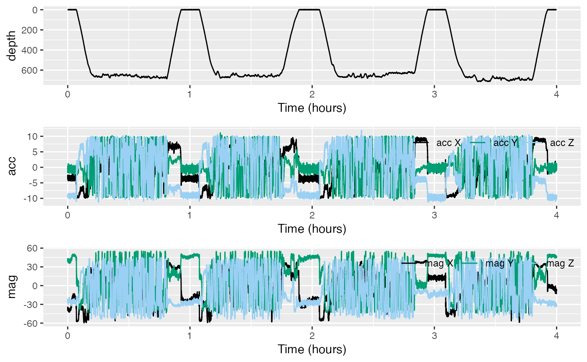
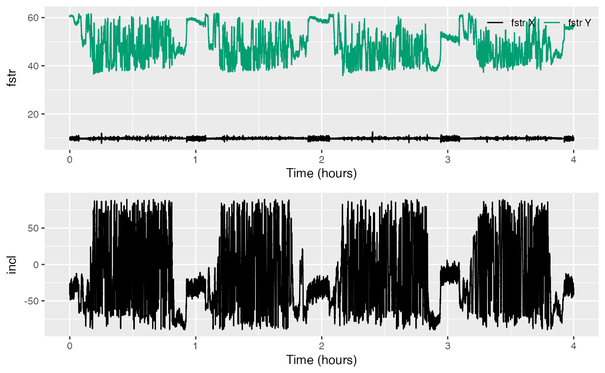
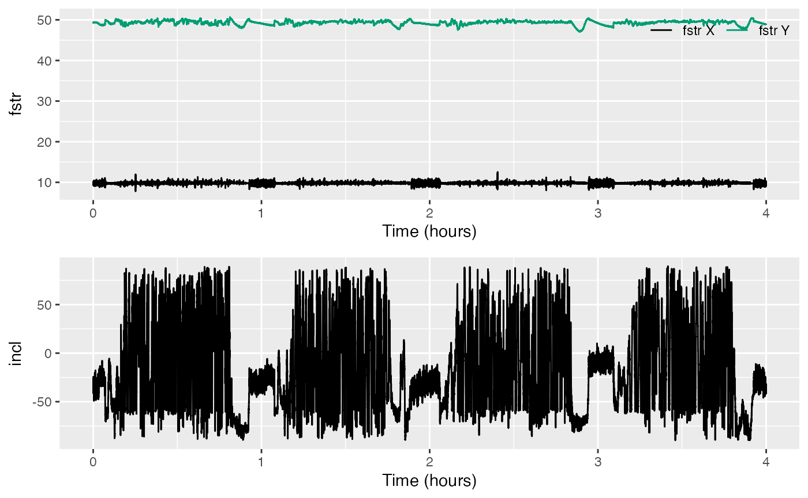
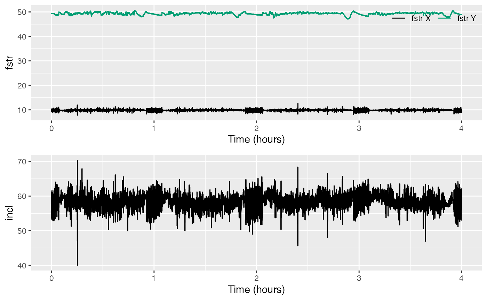

# Data quality & error correction

Welcome to the `data-quality-error-correction` vignette! Thanks for
taking some time to get to know our package. We hope you’re enjoying
yourself.

This vignette deals with how to check data quality for accelerometers
and magnetometers, as well as how to make corrections for some common
sources of error.

*Estimated time for this practical: 25 minutes*

These vignettes assume that you have R/Rstudio installed on your
machine, some basic experience working with them, and can execute
provided code, making some user-specific changes along the way (e.g. to
help R find a file you downloaded). We will provide you with quite a few
lines. To boost your own learning, you would do well to try and write
them before opening what we give, using this just to check your work.

Additionally, be careful when copy-pasting special characters such as
\_underscores\_ and ‘quotes’. If you get an error, one thing to check is
that you have just a single, simple underscore, and `'straight quotes'`,
whether `'single'` or `"double"` (rather than “smart quotes”).

## Checking accelerometer and magnetometer data

Biologging data are not always ready-to-use when you read them off the
tag. Some corrections may be needed. Quality checking is fairly easy for
pressure data from aquatic mammals because we know they will breathe at
the surface. Data from accelerometers and magnetometers are more
difficult. For one thing, there are three axes, and also we don’t have
such an intuitive feel for what they should look like. However,
fortunately, there are some quality checks we can do with `A` and `M`
data that help to catch and correct problems.

Our objective here is to estimate the orientation of an animal (its
pitch, roll and heading) as a function of time. To do so we first need
to check and correct errors in `A` and `M`.

### Data quality checks

For this practical we will use data from a tag attached to the back of a
sperm whale. If you want to run this example, download the
“rawtestset3.nc” file from <https://github.com/animaltags/tagtools_data>
and change the file path to match where you’ve saved the files

``` r
library(tagtools)
sw_file_path <- "nc_files/rawtestset3.nc"
sw <- load_nc(sw_file_path)
```

Look at the overall structure to get an idea of how the data are stored,
and check out the info structure to see where the data came from.

``` r
str(sw, max.level = 1)
sw$info
```

Show/Hide Results

    #> [1] "results for `str(sw, max.level = 1)`:"
    #> [1] "-------------------------------------"
    #> List of 5
    #>  $ _empty:List of 1
    #>  $ P     :List of 16
    #>  $ A     :List of 18
    #>  $ M     :List of 18
    #>  $ info  :List of 36
    #>  - attr(*, "class")= chr [1:2] "animaltag" "list"
    #> [1] "-------------------------------------"
    #> [1] "and results for `sw$info`:"
    #> [1] "-------------------------------------"
    #> $depid
    #> [1] "sw03_165a"
    #> 
    #> $dtype_source
    #> [1] "sw03_165aprh.mat,sw03_165aaud.txt"
    #> 
    #> $dtype_datetime_made
    #> [1] "18/07/2017 22:15:00"
    #> 
    #> $dtype_nfiles
    #> [1] "1"
    #> 
    #> $dtype_format
    #> [1] "MAT"
    #> 
    #> $device_serial
    #> [1] ""
    #> 
    #> $device_make
    #> [1] "DTAG"
    #> 
    #> $device_type
    #> [1] "Archival"
    #> 
    #> $device_model
    #> [1] "DTAG2"
    #> 
    #> $device_url
    #> [1] "https://www.soundtags.org"
    #> 
    #> $sensors_firm
    #> [1] "Not specified"
    #> 
    #> $sensors_soft
    #> [1] "Not specified"
    #> 
    #> $sensors_list
    #> [1] "3axis Accelerometer,3 axis Magnetometer,Pressure,Sound"
    #> 
    #> $animal_id
    #> [1] "Unknown"
    #> 
    #> $animal_species_common
    #> [1] "Sperm whale"
    #> 
    #> $animal_species_science
    #> [1] "Physeter macrocephalus"
    #> 
    #> $animal_dbase_url
    #> [1] "http://www.arkive.org/sperm-whale/physeter-macrocephalus/"
    #> 
    #> $animal_dbase_itis
    #> [1] "180488"
    #> 
    #> $dephist_device_tzone
    #> [1] "0"
    #> 
    #> $dephist_device_regset
    #> [1] "dd/mm/yyyy HH:MM:SS"
    #> 
    #> $dephist_device_datetime_start
    #> [1] "2003-06-14 18:38:35"
    #> 
    #> $dephist_deploy_locality
    #> [1] "northern Gulf of Mexico"
    #> 
    #> $dephist_deploy_location_lat
    #> [1] "28.48"
    #> 
    #> $dephist_deploy_location_lon
    #> [1] "-89.052"
    #> 
    #> $dephist_deploy_datetime_start
    #> [1] "2003-06-14 18:38:35"
    #> 
    #> $dephist_deploy_method
    #> [1] "Suction cups"
    #> 
    #> $project_name
    #> [1] "GOM 2003"
    #> 
    #> $project_datetime_start
    #> [1] "2003-06-03"
    #> 
    #> $project_datetime_end
    #> [1] "2003-06-24"
    #> 
    #> $provider_name
    #> [1] "Mark Johnson"
    #> 
    #> $provider_details
    #> [1] "Univ St Andrews"
    #> 
    #> $provider_email
    #> [1] "info@animaltags.org"
    #> 
    #> $provider_license
    #> [1] "Contact data provider"
    #> 
    #> $provider_cite
    #> [1] "Contact data provider"
    #> 
    #> $provider_doi
    #> [1] "Contact data provider"
    #> 
    #> $creation_date
    #> [1] "02-Dec-2019 16:14:58"

Inspect the depth, acceleration and magnetometer data with `plott`:

``` r
plott(X = list(depth = sw$P, acc = sw$A, mag = sw$M))
```

Show/Hide Results



Depth, `sw$P`, seems fine—it looks like a depth versus time plot for a
diving whale. However, it is hard to see whether there are any problems
with accelerometer and magnetometer data, `sw$A` and `sw$M`, from their
respective plots. Two things can often go wrong with raw tag data:

- the sensors may not be well-calibrated, and
- the axes of `A` and `M` may not be aligned with the animal’s axes.

Luckily, we can check both of these from the data.

When there is not much specific acceleration, the vector magnitude of
each acceleration measurement should be close to the magnitude of the
gravity vector, i.e., 9.8 $`\frac{m}{s^2}`$.

The magnetometer data should also have fairly constant vector magnitude
equal to the field strength where the data came from. It should be about
48 $`\mu`$T in this case since the tag was deployed at
$`28.48^{\circ}`$, $`-89.052^{\circ}`$ latitude/longitude. (That is,
$`28.48^{\circ}`$ north latitude, $`89.052^{\circ}`$ west longitude.)

*(A useful website to find the geomagnetic field parameters, based on
where your tag is deployed from, is:
<https://www.ngdc.noaa.gov/geomag-web/#igrfwmm>.)*

Finally, the angle between `A` and `M` should be close to the magnetic
inclination angle, which is also locally constant, $`59^{\circ}`$ in
this case.

Use
[`check_AM()`](https://animaltags.github.io/tagtools_r/reference/check_AM.md)
to compute the field strength of `A` and `M` and their inclination
angle. Recall that A is stored as `sw$A` and M is stored as `sw$M`, and
write the result to a new object `AMcheck` or another similar name. Then
check out what this object contains.

``` r
AMcheck <- check_AM(sw$A, sw$M)
str(AMcheck, max.level = 1)
```

Show/Hide Results

    #> List of 2
    #>  $ fstr: num [1:71975, 1:2] 9.76 9.62 9.39 9.32 9.31 ...
    #>  $ incl: num [1:71975, 1] -0.655 -0.634 -0.62 -0.577 -0.529 ...

You should be able to tell AMcheck is a list containing two vectors,
`AMcheck$fstr` (field strength) and `AMcheck$incl` (inclination). Open
the next code to see how we plott these.

``` r
sampling_rate <- sw$A$sampling_rate # get the sampling rate of A and M for plotting
# plott fstr, and incl (converting from radians to degrees)
plott(X = list(fstr = AMcheck$fstr, incl = AMcheck$incl*180/pi), fsx = sampling_rate)
```

Show/Hide Results



The top plot shows the field strength of `A` and `M`. These should be
close to 9.8 and 48, respectively, with little variation. If not, the
acceleration or magnetometer data need re-calibration. Usually, the
problem is with `M` and is due to stray magnetic fields in the tag. Fix
this by doing a ‘hard-iron correction’, which the function
`fix_offset_3d` can do.

Again, recall that `M` is stored within `sw` as `sw$M`. Write the result
as an object `Mf`, then look at what `Mf` contains.

``` r
Mf <- fix_offset_3d(sw$M)
str(Mf, max.level = 1)
```

Show/Hide Results

    #> List of 2
    #>  $ X:List of 19
    #>  $ G:List of 1

This should show you that Mf is itself a list with two elements, `Mf$X`
and `Mf$G`. Comparing `Mf$G` and `Mf$X` with `sw$A`,

``` r
str(Mf$G, max.level = 1)
str(Mf$X, max.level = 1)
str(sw$A, max.level = 1)
```

Show/Hide Results

    #> [1] "----------------"
    #> [1] "results for Mf$G"
    #> [1] "----------------"
    #> List of 1
    #>  $ poly: num [1:3, 1:2] 1 1 1 9.64 -5.58 ...
    #> [1] "----------------"
    #> [1] "results for Mf$X"
    #> [1] "----------------"
    #> List of 19
    #>  $ data              : num [1:71975, 1:3] -28.6 -28.1 -27.4 -26.6 -25.6 ...
    #>  $ sampling          : chr "regular"
    #>  $ sampling_rate     : num 5
    #>  $ sampling_rate_unit: chr "Hz"
    #>  $ depid             : chr "sw03_165a"
    #>  $ creation_date     : chr "07-Aug-2017 15:32:56"
    #>  $ history           : chr "fix_offset_3d"
    #>  $ type              : chr "mag"
    #>  $ full_name         : chr "Magnetometer"
    #>  $ description       : chr "triaxial magnetometer"
    #>  $ unit              : chr "uT"
    #>  $ unit_name         : chr "micro Tesla"
    #>  $ unit_label        : chr "\\muT"
    #>  $ start_offset      : num 0
    #>  $ start_offset_units: chr "second"
    #>  $ column_name       : chr "x,y,z"
    #>  $ frame             : chr "sensor"
    #>  $ axes              : chr "FRU"
    #>  $ cal_poly          : num [1:3, 1:2] 1 1 1 9.64 -5.58 ...
    #> [1] "----------------"
    #> [1] "results for sw$A"
    #> [1] "----------------"
    #> List of 18
    #>  $ data              : num [1:71975, 1:3] -3.49 -3.32 -3.04 -2.89 -2.73 ...
    #>  $ sampling          : chr "regular"
    #>  $ sampling_rate     : num 5
    #>  $ sampling_rate_unit: chr "Hz"
    #>  $ depid             : chr "sw03_165a"
    #>  $ creation_date     : chr "07-Aug-2017 15:32:56"
    #>  $ history           : chr "sens_struct,decdc(5)"
    #>  $ type              : chr "acc"
    #>  $ full_name         : chr "Acceleration"
    #>  $ description       : chr "triaxial acceleration"
    #>  $ unit              : chr "m/s2"
    #>  $ unit_name         : chr "meters per seconds squared"
    #>  $ unit_label        : chr "m/s^2"
    #>  $ start_offset      : num 0
    #>  $ start_offset_units: chr "second"
    #>  $ column_name       : chr "x,y,z"
    #>  $ frame             : chr "tag"
    #>  $ axes              : chr "FRU"

you’ll notice that `Mf$X` and `sw$A` structures contain the same kind of
data. Hence `Mf$X` can stand in for `sw$M` (`Mf` by itself cannot). So,
try and re-run
[`check_AM()`](https://animaltags.github.io/tagtools_r/reference/check_AM.md)
with `sw$A` and `Mf$X` to see if the field strength has improved.

``` r
AMcheck2 <- check_AM(sw$A, Mf$X)
plott(X = list(fstr = AMcheck2$fstr, incl = AMcheck2$incl*180/pi), fsx = sampling_rate)
```

Show/Hide Results



If all has gone well, your field strength should be pretty constant at
right around 48 $`\mu`$T. Is it? Great work!

Now look again at the inclination angle (bottom plot). Chances are, it
doesn’t look consistently close to $`59^{\circ}`$. Therefore, we need to
do the next step…

### Correcting the axes of triaxial sensor data

If the field strength is okay for `A` and `M` but the inclination angle
is wrong, this is a strong indication that the magnetometer and
accelerometer axes don’t match. Assuming that the accelerometer axes are
correct, I found by trial and error that the magnetometer axes are
mapped as follows:

| Sensor.axis | Tag.axis |
|:------------|:---------|
| x           | -x       |
| y           | z        |
| z           | y        |

You could make these corrections to `Mf` one-by-one, but it is probably
more convenient to do them all at once. To make this happen, define a
‘map’ matrix that summarizes the changes:

``` r
Map <- matrix(c(-1, 0, 0,
                0, 0, 1,
                0, 1, 0),
              nrow = 3, ncol = 3, byrow = TRUE)
```

Show/Hide Results

    #>      [,1] [,2] [,3]
    #> [1,]   -1    0    0
    #> [2,]    0    0    1
    #> [3,]    0    1    0

Use function
[`rotate_vecs()`](https://animaltags.github.io/tagtools_r/reference/rotate_vecs.md)
to apply `Map` to `Mf$X` and make a new ‘tag frame’ data structure:

``` r
Mt <- rotate_vecs(Mf$X,Map)
```

`Mt` is now oriented in the tag’s frame of reference. Add this important
information about `Mt` into the structure `Mt`:

``` r
Mt$frame <- 'tag'
Mt$sensor_map <- Map        # save the Map matrix too
str(Mt, max.level = 1)
```

Show/Hide Results

    #> List of 20
    #>  $ data              : num [1:71975, 1:3] 28.6 28.1 27.4 26.6 25.6 ...
    #>  $ sampling          : chr "regular"
    #>  $ sampling_rate     : num 5
    #>  $ sampling_rate_unit: chr "Hz"
    #>  $ depid             : chr "sw03_165a"
    #>  $ creation_date     : chr "07-Aug-2017 15:32:56"
    #>  $ history           : chr "fix_offset_3d"
    #>  $ type              : chr "mag"
    #>  $ full_name         : chr "Magnetometer"
    #>  $ description       : chr "triaxial magnetometer"
    #>  $ unit              : chr "uT"
    #>  $ unit_name         : chr "micro Tesla"
    #>  $ unit_label        : chr "\\muT"
    #>  $ start_offset      : num 0
    #>  $ start_offset_units: chr "second"
    #>  $ column_name       : chr "x,y,z"
    #>  $ frame             : chr "tag"
    #>  $ axes              : chr "FRU"
    #>  $ cal_poly          : num [1:3, 1:2] 1 1 1 9.64 -5.58 ...
    #>  $ sensor_map        : num [1:3, 1:3] -1 0 0 0 0 1 0 1 0

Check the field strength and inclination of `sw$A` and `Mt` once more.
Try and do this on your own, then check your work with the code below:
write a new object, perhaps `AMcheck3`, with the result of check_AM on
`sw$A` and `Mt`. Then use your new object `AMcheck3` in place of
`AMcheck2` to get the same two plots, but with the newly corrected data.

``` r
AMcheck3 <- check_AM(sw$A, Mt)
plott(X = list(fstr = AMcheck3$fstr, incl = AMcheck3$incl*180/pi), fsx = sampling_rate)
```

Show/Hide Results



Are we good? Bear in mind that the inferred inclination angle from
accelerometer and magnetometer data is usually a bit noisy so don’t
expect `incl` to be exactly on the expected inclination angle. It should
get pretty close, though (around $`59^{\circ}`$).

When you are comfortable that the data pass the quality checks, save
them to a new NetCDF file:

``` r
save_nc('testset3_tag_frame', X = list(sw$A, Mt, sw$P, sw$info))
```

The corrections that you made to get `Mt` are stored in its structure so
this information will also be saved automatically in your nc file -
verify this by showing the contents of `Mt`.

``` r
str(Mt)
```

Show/Hide Results

    #> List of 20
    #>  $ data              : num [1:71975, 1:3] 28.6 28.1 27.4 26.6 25.6 ...
    #>  $ sampling          : chr "regular"
    #>  $ sampling_rate     : num 5
    #>  $ sampling_rate_unit: chr "Hz"
    #>  $ depid             : chr "sw03_165a"
    #>  $ creation_date     : chr "07-Aug-2017 15:32:56"
    #>  $ history           : chr "fix_offset_3d"
    #>  $ type              : chr "mag"
    #>  $ full_name         : chr "Magnetometer"
    #>  $ description       : chr "triaxial magnetometer"
    #>  $ unit              : chr "uT"
    #>  $ unit_name         : chr "micro Tesla"
    #>  $ unit_label        : chr "\\muT"
    #>  $ start_offset      : num 0
    #>  $ start_offset_units: chr "second"
    #>  $ column_name       : chr "x,y,z"
    #>  $ frame             : chr "tag"
    #>  $ axes              : chr "FRU"
    #>  $ cal_poly          : num [1:3, 1:2] 1 1 1 9.64 -5.58 ...
    #>  $ sensor_map        : num [1:3, 1:3] -1 0 0 0 0 1 0 1 0

Your processing steps are listed in the ‘history’ field and so are
traceable as you would expect in a professional archive.

## Review

What have you learned? A few powerful tools for detecting and correcting
common errors in raw data.

Great work! You’ve completed this vignette.

*If you’d like to continue working through these vignettes,
`tag-to-whale-frame` is probably a good option. It deals with estimating
and correcting the orientation of a tag on an animal. This vignette will
use tag data that* are not *aligned to the animal’s body axes, e.g.,
because the tag was applied to a free-moving whale.*

``` r
vignette('tag-to-whale-frame')
```

------------------------------------------------------------------------

Animaltags tag tools online: <http://animaltags.org/>,
<https://github.com/animaltags/tagtools_r> (for latest beta source
code), <https://animaltags.github.io/tagtools_r/index.html> (vignettes
overview)
