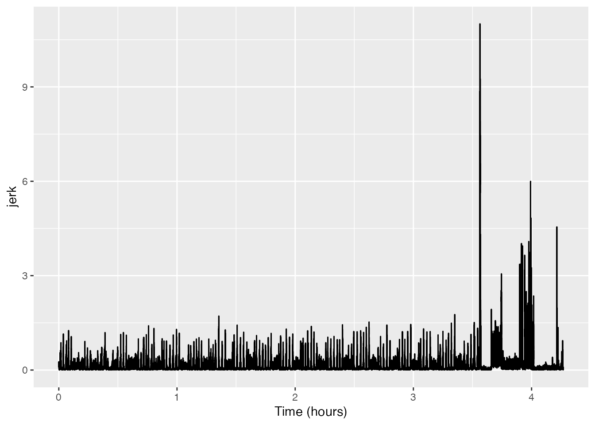
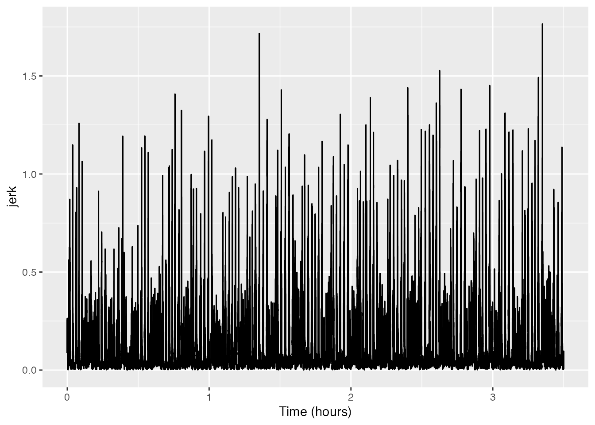
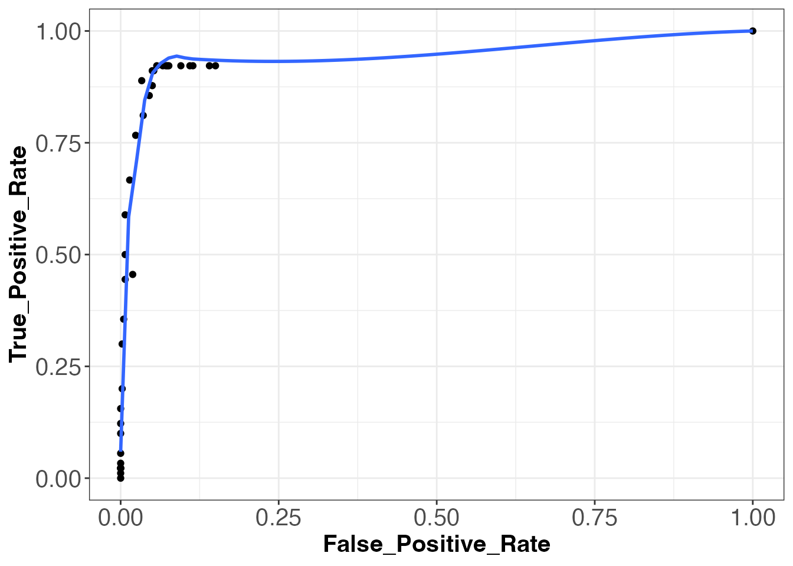
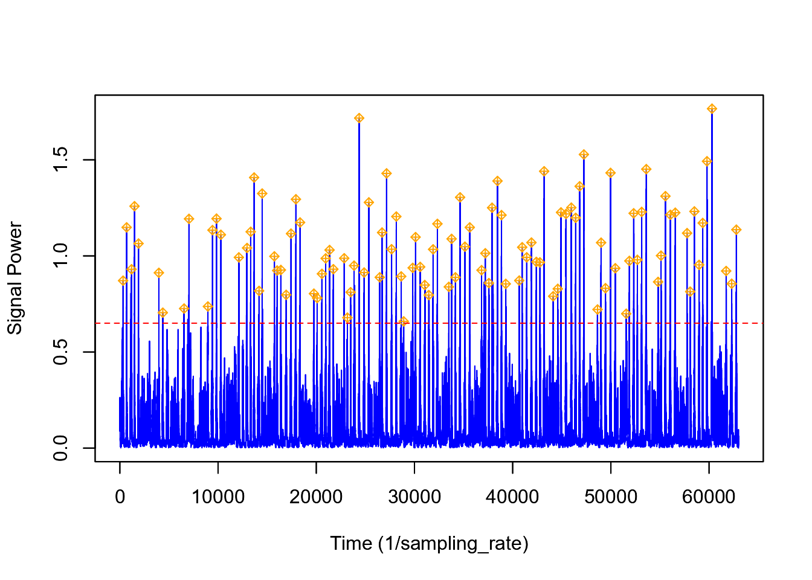

# Detectors

## Introduction

      Scientists have long struggled to study animal behavior while
minimizing the amount of imposed stress upon the animal being observed
(Brown et al., 2013; Schneirla, 1950). Difficulty also arises while
attempting to observe animals in environments and during time periods
that are relatively inaccessible to humans (Allen et al., 2016). Out of
these two concerns arose the scientific field of biotelemetry (Kooyman,
2003). Since the first use of tagging devices on animals in 1963, the
field of biotelemtery has evolved into a discipline that allows for the
detailed behavioral studying of animals ranging in size from chipmunks
to blue whales (Hammond et al., 2016; Acevedo-Gutiérrez et al., 2002;
Kooyman, 2003).

      Marine biologging has become one of the most prominent fields of
biotelemetry. A variety of unique tagging systems (i.e. DTAGs (Johnson
and Tyack, 2003), Acousonde tags (Burgess et al., 1998), etc.) have been
developed by researchers around the world to try to gain non-invasive
access into the unique lives of marine creatures. From the data obtained
by these tags, scientists are able to determine the exact moment in time
when an animal exhibited a certain behavior (Johson et al., 2009;
Goldbogen et al., 2006; Goldbogen et al., 2008; Miller et al., 2004).
However, due to the often high sampling rate of multisensor tags and the
long duration of data recording, the process of determining the time of
every instance of a given behavior can be quite laborious and time
consuming.

      In a quest to make data analysis more efficient, scientists have
begun to develop software functions, which automatically detect animal
behaviors from multisensor data (Owen et al., 2016; Allen et al., 2016;
Doniol-Valcroze et al., 2011; Kokubun et al., 2011; Cox et al., 2017;
Ware et al., 2011; Viviant et al., 2010). These functions scan through
data searching for signal characteristics, which are known to be
indicators of unique animal behaviors. While many of these methods have
very specific data format requirements, more flexible methods that can
easily be applied to data from many species and tag types would
facilitate inter-study and inter-specific comparisons and meta-analysis
of a variety of different animal behaviors.

      In light of this, we have developed a function, usable in three
widely used software programs (R (R Core Team 2017), Matlab (MathWorks,
Natick, MA, USA), and Octave (Eaton et al., 2016)), which is
generalizable to a wide variety of data types/formats, animals, and
behaviors. The function, called `detect_peaks`, is a part of the
tagtools package in R.

## Function Design

      The `detect_peaks` function contains 6 specified inputs and allows
for additional inputs to be added at the end of the command.

``` r
detect_peaks(data, sr, FUN = NULL, thresh = NULL, bktime = NULL, plot_peaks = NULL,...)
```

      In this vignette, I will be describing what you, the user, need to
understand before using this function and the thought process behind
each significant step in the function script. Later on, in the section
titled [Case Study](#case-study), I will walk through a specific example
in which the function may be used.

      In order to make the best use of this function, it is helpful to
understand a few things regarding its design. As the name of the
function suggests, this function determines the time of an animal
behavior by going through large data sets and locating large
spikes/peaks in a data signal. A peak is determined to represent a
behavior event if it surpasses a predetermined threshold. In this
function, the default threshold level (input `thresh`) is set to be the
0.99 quantile of the signal. However, this threshold level will not be
appropriate for all circumstances. There may be cases in which this
threshold level will result in many false positive detections (peak
detected without a present behavior) or insufficient true positive
detections (peak detected with a present behavior). Typically, if the
threshold is too high, the number of missed detections will be high and
only the strongest peaks representing behavior events will be detected.
If the threshold is too low, the number of true positive detections will
be high, but so will the number of false positives (Urick, 1967).
Therefore, we allow the user to change the threshold level if they
desire a level other than the default. More information about
determining the best threshold level can be found in the case study
below.

      Once the peaks in the signal have been detected, the blanking time
(input `bktime`) is used to determine the start and end times of each
peak as well as the time at which the peak reached a maximum level in
the signal. The blanking time is an amount of time within which all
detected peaks are determined to represent one large, unified behavior
event. The default value for the blanking time is set as the 0.80
quantile of a vector containing the time differences between consecutive
signal values that surpass the specified threshold. The first job of the
blanking time is to determine if adjacent peaks represent one or
multiple behavior events. All detected peaks separated by a length of
time larger than the blanking time are considered distinct behavior
events. After this is done, start times (point at which the peak first
exceeds the threshold), end times (point at which the peak finally
recedes beneath the threshold value), peak times (point at which the
peak reaches a maximum signal strength), and peak maximum (maximum value
of the detected peak in the same units as the signal) are determined and
returned in the output.

      After the function has finished running, the signal being studied
is plotted (assuming the input for `plot_peaks` is TRUE) with each
determined peak labeled by a marker. At this point, you are able to
examine the quality of the function’s performance at detecting true
positive events. If you determine that you wish for the threshold level
or the blanking time to be altered, you can click on the graph to change
these values. For example, if you want to change only the threshold
level, you can click once within the plot at the given threshold level
desired and click “Finish”. This will rerun the function and return new
peak detections and a new plot. If you only want to change the blanking
time, you must click twice within the plot and then click “Finish”. The
distance between each click is determines the new blanking time and the
function is rerun. If you want to change both the threshold and the
blanking time, you must click three times. The first click is to change
the threshold and the second two clicks are to alter the blanking time.
After clicking three times, the function is rerun. For the occasion when
you are satisfied with the threshold and blanking times used in the
first run of the function, you must simply click the “Finish” button
located just above the plot, and peak detections will be returned. Along
with the peak detections, the threshold level and blanking time used in
the analysis are also returned in the ouput.

      A final crucial thing to understand before using this function is
that the input for `data` can be either a signal vector or a matrix of
data. If the data is a signal vector, which the user wishes to have
peaks detected from, nothing should be given for the input `FUN`.
However, if the data given to the input is a matrix, an input for `FUN`
must be given as the peak detector is not able to detect peaks from
matrix data. The input for `FUN` is some function which the user wishes
apply to the data matrix to generate a signal vector (which then passes
through the peak detection process as described above). The signal
vector should be some metric whose values are large when events occur,
and small otherwise – the more specific to the event being detected, the
better. Examples of functions to pass to “FUN” from the tagtools package
are `njerk`, `odba`, etc., but any function (including a custom function
written by the user) can be used. I will provide examples of how the
`detect_peaks` function works for both vector and matrix inputs in the
case study below.

## Case Study

### Detecting lunge feeding events of a blue whale from triaxial acceleration data

      In this case study, I will be providing an example on how to use
the `detect_peaks` function in order to detect the times of lunge
feedings events of a blue whale. Previous studies have shown the
effectiveness of using the norm jerk of triaxial acceleration to detect
the presence of lunge feeding events in tag data (Simon et al., 2012;
Owen et al., 2016). The norm jerk is the square-root of the sum of the
squares of each axis of the acceleration matrix. This is a good proxy
for feeding behavior events because blue whales, and other lunge feeding
whales, are known to drastically increase their speed and acceleration
while approaching a feeding patch. Then, upon opening their mouthes to
engulf the prey, there is an extremely sudden decrease in speed and
acceleration due to drag. This rapid increase and decrease in speed and
acceleration can be observed in the norm jerk signal as a large peak in
the signal. Thankfully, the tagtools package has the function njerk
which can be used to convert our acceleration matrix into the norm jerk
signal vector.

      To begin, I will load the data to be used in this case study. All
of the following data was obtain by members of the SOCAL Behavioral
Response Study project (<https://sea-inc.net/science/socal-brs/>). This
particular blue whale was tagged with a DTAG2, which gathered
multisensor data including, but not limited to, triaxial accelerometer
and pressure (depth) data. This particular data set has been used in a
variety of publications (DeRuiter et al., 2017; Goldbogen et al., 2013;
Goldbogen et al., 2015). For the time being, we will load the
acceleration matrix (within the whale frame) from the blue whale data
set. To do this, we will use the `read_csv` function from the package
`readr`. (If you need it, `install_packages("readr")` should do the
trick.) The acceleration matrix within the whale frame will be labeled
as “Aw”. I will also create a variable “sampling_rate” that specifies
the sampling rate of my acceleration data, which is used to run the
njerk function. Then, I will look at the first few rows of Aw and
sampling_rate to confirm this has worked properly.

``` r
library(readr)
bw11_210a_tagdata <- readr::read_csv('https://sldr.netlify.app/data/bw11_210a_tagdata.csv')
Aw <- cbind(bw11_210a_tagdata$Awx, bw11_210a_tagdata$Awy, bw11_210a_tagdata$Awz)
sampling_rate <- bw11_210a_tagdata$fs[1]  
head(Aw, 5)
head(sampling_rate)
```

Show/Hide Results

    ##           [,1]     [,2]     [,3]
    ## [1,] -0.757237 0.256707 0.594229
    ## [2,] -0.754772 0.243776 0.613680
    ## [3,] -0.749972 0.231498 0.635822
    ## [4,] -0.741841 0.231193 0.662992
    ## [5,] -0.730536 0.256309 0.700784

    ## [1] 5

      Next, I will generate the norm jerk signal using the function
njerk. A plot provides a helpful visualization of the signal.

``` r
library(tagtools)
jerk <- njerk(A = Aw, sampling_rate = sampling_rate)
X <- list(jerk = jerk)
plott(X, 5) 
```

Show/Hide Results



      As you can see, what used to be an acceleration matrix has now
been converted into the norm-jerk signal vector. From this plot, you can
already begin to get an idea of where some of the lunge feeding events
might be if you notice the occasional peaks in the signal. However, the
peaks to the right of the 63000 time value begin to look completely
unlike any of the other data. (This equals 3.5 hours: 63000 signals
times (one second per five signals) times (one hour per 3600 seconds) =
63000 / 18000 = 3.5.) A good explanation is that this is because at this
time, the tag has fallen off the whale. Consequentially, past this time,
it is no longer recording the norm jerk of the whale’s movement, but
instead the norm jerk of the tag as it is floating to the surface of the
ocean. Because it is likely that these peaks will skew our results, we
will remove the data after sample 63000.

``` r
jerk <- jerk[1:63000]
```

      The next step in detecting the event of a lunge feeding behavior
is to gather the rest of the data necessary to use the detect_peaks
function. In order to run the detect_peaks function, we must have have
the variable `sr`, which is the sampling rate of our `data` input. You
might think to yourself, “Isn’t that the same as `sampling_rate`, which
we already gathered?” You would be correct. However, due to the nature
of the function, the sampling rate must be labeled as something other
than “sampling_rate”.

``` r
sr <- bw11_210a_tagdata$fs[1]  
```

      At this point, we are almost ready to apply our norm jerk signal
to the detect_peaks function. One thing to consider first, however, is
whether we want to set a specified threshold and/or blanking time value
or if we are okay simply using the default values for each of these
inputs. In this instance, let’s assume that we don’t know what the
perfect threshold value or blanking time should be. So we will use the
default settings (for now).

``` r
detect_peaks(data = jerk, sr = sr, FUN = NULL,
                 thresh = NULL, bktime = NULL, plot_peaks = TRUE)
```


In the case where we did not need/want to see the jerk signal before
running the detect_peaks function, we could have produced the same
results using the following code:

``` r
detect_peaks(data = Aw[1:63000, ], sr = sr, FUN = njerk, 
                thresh = NULL, bktime = NULL, plot_peaks = TRUE, sampling_rate = sampling_rate)
```

      Now, looking at the generated plot we can see the same signal as
before, but now the plot has markers identifying all of the peaks that
were detected. At this time, you can decide if you wish to change the
level of the threshold or blanking time, consequentally rerunning the
function. If you wish to accept the peak detections displayed, you can
end the function and obtain the output list of detection times and
levels. In order to fully walk through the capabilities of this
function, let’s imagine that you wish to change both the threshold and
the blanking time values to see how the output might change. To do this
yourself, you would click within the plot, but given that I cannot do
that, I will list the coordinates \[x, y\] as if I had clicked in three
different locations on the plot: \[19873, 0.874\], \[20000, 1.258\],
\[19950, 0.736\]. Based off of these three coordinates, the threshold
value when the function is rerun will be 0.874, and the blanking time
will be 50. Below is the new plot and a summary of our results. I have
included the new code to provide a helpful visual, but when using
detect_peaks() on your own, it is not necessary to retype the function
after changing your threshold and/or blanking time from the interactive
plot.

``` r
peaks <- detect_peaks(data = jerk, sr = sr, FUN = NULL, 
                          thresh = 0.874, bktime = 50, plot_peaks = TRUE)
plott(X, sampling_rate)
```

``` r
plott(X, sampling_rate)
str(peaks)
```



    ## 'data.frame':    232 obs. of  6 variables:
    ##  $ start_time: num  326 687 1124 1130 1187 ...
    ##  $ end_time  : num  326 692 1125 1130 1191 ...
    ##  $ peak_time : num  326 690 1124 1130 1190 ...
    ##  $ peak_max  : num  0.871 1.149 0.806 0.672 0.931 ...
    ##  $ thresh    : num  0.67 0.67 0.67 0.67 0.67 ...
    ##  $ bktime    : num  3.2 3.2 3.2 3.2 3.2 3.2 3.2 3.2 3.2 3.2 ...

#### ROC Curves and Detection Optimization

      Receiver operating characteristic (ROC) curves are a type of plot
that are used in order to enhance the overall performance of automated
event detection functions by determining an optimal threshold level.
These plots are generated by determining the true positive rate and the
false positive rate of an event detection function (in this case
detect_peaks) at a specified threshold level. A single point on the plot
specifies the true positive rate and false positive rate at one
specified threshold level. Therefore, in order to generate a full ROC
curve, event detections must be performed at a variety of different
thresholds. The rate of true positive detections is calulated by
dividing the number of true positive detections by the number of actual
events. The rate of false positive detections is calculated by dividing
the number of false positive detections by the total number of possible
events within the time of tag recording. Determining the number of total
possible events can be very difficult, unfortunately, because in a
biological system, the value is dependent upon a long list of
determining factors. For example, the number of times a whale can lunge
feed within a given amount of time is dependent upon the availability of
its food source, the energy required to swim through currents, the time
required to filter water through its baleen after engulfing prey, etc.
In a paper written by Jeremy Goldbogen of Stanford University, fin
whales were determined to be able to lunge feed every 44.5 ± 19.1
seconds (Goldbogen et al., 2006). Therefore, since blue whales are of
similar size to fin whales, averaging only a few meters longer, let’s
say that blue whales are able to lunge feed after a minimum of 30
seconds since the previous feeding event. Using this number, we can
determine the total possible number of lunge feeding events by dividing
the total number of samples in our data by the sampling_rate, and then
dividing this number by 30. By doing this, we get 420 total possible
lunge feeding events (tpevents) by our blue whale.

``` r
tpevents <- (63000 / sampling_rate) / 30
```

      The number of known events is also hard to determine as it
requires a trained scientist to manually scroll through a signal,
looking for distinct characteristics in the plot that are known to be
related to the desired behavioral event. Lucky for us, this hard work
has already been completed by members of the SOCAL BRS project. We will
name the vector containing the known times of lunges in our data set as
“events”. Now, because the event times determined by the members of
SOCAL BRS are in units of seconds, we must first multiply our vector by
the sampling rate in order to have the units be in samples.

``` r
head(events, 8)
```

    ## [1]  340  700 1195 1505 1910 3980 4380 6555

      Let’s now begin to make our ROC curve. We will run the
detect_peaks function using a blanking time of 30 seconds and thresholds
ranging from .05 to the 1.75 (roughly the max of our jerk signal). We
will then determine the rate of false positive and true positive
detections at each threshold level using our known lunge times. Using
these rates, we will be able to plot the ROC curve. Shown below are the
true positive and false positive rates and the corresponding ROC plot.


    ##       True_Positive_Rate False_Positive_Rate
    ##  [1,]         0.00000000         0.000000000
    ##  [2,]         0.45555556         0.019047619
    ##  [3,]         0.88888889         0.033333333
    ##  [4,]         0.91111111         0.050000000
    ##  [5,]         0.92222222         0.076190476
    ##  [6,]         0.92222222         0.109523810
    ##  [7,]         0.92222222         0.140476190
    ##  [8,]         0.92222222         0.150000000
    ##  [9,]         0.92222222         0.114285714
    ## [10,]         0.92222222         0.095238095
    ## [11,]         0.92222222         0.073809524
    ## [12,]         0.92222222         0.071428571
    ## [13,]         0.92222222         0.066666667
    ## [14,]         0.92222222         0.057142857
    ## [15,]         0.91111111         0.052380952
    ## [16,]         0.87777778         0.050000000
    ## [17,]         0.85555556         0.045238095
    ## [18,]         0.81111111         0.035714286
    ## [19,]         0.76666667         0.023809524
    ## [20,]         0.66666667         0.014285714
    ## [21,]         0.58888889         0.007142857
    ## [22,]         0.50000000         0.007142857
    ## [23,]         0.44444444         0.007142857
    ## [24,]         0.35555556         0.004761905
    ## [25,]         0.30000000         0.002380952
    ## [26,]         0.20000000         0.002380952
    ## [27,]         0.15555556         0.000000000
    ## [28,]         0.12222222         0.000000000
    ## [29,]         0.10000000         0.000000000
    ## [30,]         0.05555556         0.000000000
    ## [31,]         0.03333333         0.000000000
    ## [32,]         0.02222222         0.000000000
    ## [33,]         0.02222222         0.000000000
    ## [34,]         0.02222222         0.000000000
    ## [35,]         0.02222222         0.000000000
    ## [36,]         0.01111111         0.000000000
    ## [37,]         1.00000000         1.000000000

      Looking at our ROC plot above, we see that the overall event
detection using the detect_peaks function was quite successful. There is
a large amount of area under the curve, representing a high performing
event detector. Now, the next step we are going to do is determine the
optimal threshold level based off our true and false positive rates
shown above. A generally accepted definition for the “optimal” threshold
level is that which has the highest ratio of true positive to false
positive detections. However, for the interest of this case study, let
us assume that we wish to find the threshold level at which we obtained
a maximum number of true positive detections. From looking at our
detection rates above, we see that this occured at thresholds between
0.20 and 0.65. Becauses we have multiple thresholds at which a maximum
true positive rate was achieved, we are going to find which of these
thresholds posseses the highest ratio of true positive to false positive
detections, and we will then use this as our “optimal” threshold.

``` r
rates[5:14, 1] / rates[5:14, 2]
```

    ##  [1] 12.104167  8.420290  6.564972  6.148148  8.069444  9.683333 12.494624
    ##  [8] 12.911111 13.833333 16.138889

      We see that the last value above possesses the highest ratio. This
value represents the ratio for the threshold of 0.65. The final step in
optimizing event detection method is to utilize our “optimal” threshold
and use it to run our detect_peaks function one final time.

``` r
peaks <- detect_peaks(data = Aw[1:63000, ], sr = 5, FUN = njerk, thresh = 0.65, bktime = 30, plot_peaks = FALSE, sampling_rate = 5)
```



``` r
str(peaks)
```

    ## 'data.frame':    107 obs. of  6 variables:
    ##  $ start_time: num  326 687 1124 1490 1880 ...
    ##  $ end_time  : num  326 692 1191 1497 1899 ...
    ##  $ peak_time : num  326 690 1190 1492 1899 ...
    ##  $ peak_max  : num  0.871 1.149 0.931 1.259 1.064 ...
    ##  $ thresh    : num  0.65 0.65 0.65 0.65 0.65 0.65 0.65 0.65 0.65 0.65 ...
    ##  $ bktime    : num  30 30 30 30 30 30 30 30 30 30 ...

``` r
depth <- bw11_210a_tagdata$depth
cropped_depth <- depth[1:63000]
lunges <- data.frame(klunge = (((events / 5) / 60) / 60),
                     depthevents = cropped_depth[events])
event_detections <- data.frame(dettimes = (((peaks$peak_time / 5) / 60) / 60),
                               depthdetections = cropped_depth[peaks$peak_time])
Dive_Profile <- data.frame(Dive_Profile = cropped_depth)
ggplot2::ggplot(Dive_Profile) +
  ggplot2::geom_line(ggplot2::aes(y = Dive_Profile,
                                  # time in hours
                                  x = c(0:(-1+length(cropped_depth))) / 5 / 60 / 60)) +
  ggplot2::scale_y_reverse() +
  xlab('Hours') +
  ggplot2::geom_point(data = lunges,
                      ggplot2::aes(x = klunge, y = depthevents, colour = "Lunges"),
                      inherit.aes = FALSE) +
  ggplot2::geom_point(data = event_detections,
                      ggplot2::aes(x = dettimes, y = depthdetections, col = "Events"),
                      inherit.aes = FALSE) +
  scale_color_discrete("")
```


      The resulting data shows the lunge feeding events detected by the
detect_peaks function while using an “optimal” threshold and blanking
time. I have included a plot of the dive profile of the blue whale with
the lunges detected by the detect_peaks function marked in gold and the
known lunge times marked in red. One brief note about the dive profile
plot shown above is that gold and red markings which overlap slightly
but which are not directly overlayed still represent a correctly
detected lunge feeding event. This is because the exact time at which
the lunge was determined to have occured is slightly different between
the detect_peaks function and the manual detections performed by the
SOCAL BRS researchers.

      This case study provides a very specific application of this tool
to determine the times of lunge feeding events from bio-logging
acceleration data, but the hope is that the tool is flexible enough for
use across many different signal types, species and contexts.

## Bibliography

**Acevedo-Gutiérrez, A., Croll, D.A., and Tershy, B.R.** (2002). High
feeding costs limit dive time in the largest whales. *J. Exp. Biol.*
**205**, 1747-1753.

**Allen, A.N., Goldbogen, J.A., Friedlaender, A.S., and Calambokidis,
J.** (2016). Development of an automated method of detecting stereotyped
feeding events in multisensor data from tagged rorqual whales. *Ecology
and Evolution.* **6**(20), 7522–7535.

**Brown, D.D, Kays, R., Martin, W., Wilson, R., and Klimley, A.P.**
(2013). Observing the unwatchable through acceleration logging of animal
behavior. *Animal Biotelemetry.* **1**(20).

**Burgess, W.C., Tyack, P.L., Le Boeuf, B.J., and Costa, D.P.** (1998).
A programmable acoustic recording tag and Þrst results from free-ranging
northern elephant seals. *Deep_seaResearch II.* **45**, 1327-1351.

**Cox, S.L., Orgeret, F., Gesta, M., Rodde, C., Heizer, I.,
Weimerskirch, H., and Guinet, C.** (2017). Processing of acceleration
and dive data on-board satellite relay tags to investigate diving and
foraging behaviour in free-ranging marine predators. *Methods in Ecology
and Evolution*. <doi:10.1111/2041-210X.12845>.

**Doniol-Valcroze, T., Lesage, V., Giard, J., and Michaud, R.** (2011).
Optimal foraging theory predicts diving and feeding strategies of the
largest marine predator. *Behavioral Ecology*. **22**(4), 880-888.

**Eaton, J.W., Bateman, D., Hauberg, S., and Wehbring, R.** (2016). GNU
Octave version 4.2.0 manual: a high-level interactive language for
numerical computations. URL:<https://docs.octave.org/interpreter/>.

**Goldbogen, J.A., Calambokidis, J., Shadwick, R.E., Oleson, E.M.,
McDonald, M.A., and Hildebrand, J.A.** (2006). Kinematics of foraging
dives and lunge-feeding in fin whales. *J. Exp. Biol.* **209**,
1231-1244.

**Goldbogen, J.A., Calambokidis, J., Croll, D.A., Harvey, J.T., Newton,
K.M., Oleson, E.M., Schorr, G., and Shadwick, R.E.** (2008). Foraging
behavior of humpback whales: kinematic and respiratory patterns suggest
a high cost for a lunge. *J. Exp. Biol.* **211**, 3712-3719.

**Goldbogen, J.A., Hazen, E.L., Friedlaender, A.S., Calambokidis, J.,
DeRuiter, S.L., Stimpert, A.K., and Southall, B.L.** (2015). Prey
density and distribution drive the three-dimensional foraging strategies
of the largest filter feeder. *Functional Ecology*. **29**, 951-961.

**Hammond, T.T., Springthorpe, D., Walsh, R.E., and Berg-Kirkpatrick,
T.** (2016). Using accelerometers to remotely and automatically
characterize behavior in small animals. *J. Exp. Biol.* **219**,
1618-1624.

**Johnson, M.P., Aguilar de Soto, N., and Madsen, P.T.** (2009).
Studying the behaviour and sensory ecology of marine mammals using
acoustic recording tags: a review. *Marine Ecology Progress Series*.
**395**, 55-73.

**Johnson, M.P., and Tyack, P.L.** (2003). A digital acoustic recording
tag for measuring the response of wild marine mammals to sound. *Journal
of Oceanic Engineering*. **28**(1), 3-12.

**Kokubun, N., Kim, J., Shin, H., Naito, Y., and Takahashi, A.** (2011).
Penguin head movement detected using small accelerometers: a proxy of
prey encounter rate. *J. Exp. Biol.* **214**, 3760-3767.

**Kooyman, G.L.** (2004). Genesis and evolution of bio-logging devices:
1963-2002. *Mem. Natl Inst. Polar Res.* **58**, 15-22.

**MATLAB** (2017a). *The MathWorks, Inc., Natick, Massachusetts, United
States.*

**Miller, P.O., Johnson, M.P., and Tyack, P.L.** (2004). Sperm whale
behaviour indicates the use of echolocation click buzzes ‘creaks’ in
prey capture. *The Royal Society*. **271**, 2239-2247.

**Owen, K., Dunlop, R.A., Monty, J.P., Chung, D., Noad, M.J, Donnelly,
D., Goldizen, A.W., and Mackenzie, T.** (2016) Detecting surface-feeding
behavior by rorqual whales in accelerometer data. *Marine Mammal
Science*. **32**(1), 327-348.

**Owen, K., Jenner, C.S., Jenner, M.M., and Andrews, R.D.** (2016). A
week in the life of a pygmy blue whale: migratory dive depth overlaps
with large vessel drafts. *Animal Biotelemetry*. **4**(17).

**R Core Team** (2017). R: A language and environment for statistical
computing. *R Foundation for Statistical Computing, Vienna, Austria.*
URL:<https://www.R-project.org/>.

**Schneirla, T.C.** (1950). The relationship between observation and
experimentation in the field study of behavior. *ANNALS of the New York
Academy of Sciences*. **51**, 1022-1044.

**Viviant, M., Trites, A.W., Rosen, D.A.S., Monestiez, P., and Guinet,
C.** (2010). Prey capture attempts can be detected in Steller sea lions
and other marine predators using accelerometers. *Polar Biol*. **33**,
713-719.

**Ware, C., Friedlaender, A.S., and Nowacek, D.P.** Shallow and deep
lunge feeding of humpback whales in fjords of the West Antarctic
Peninsula. *Marine Mammal Science.* **27**(3), 587-605.
