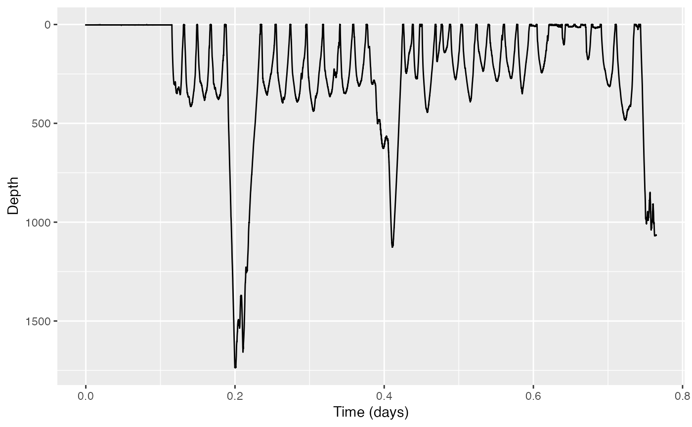
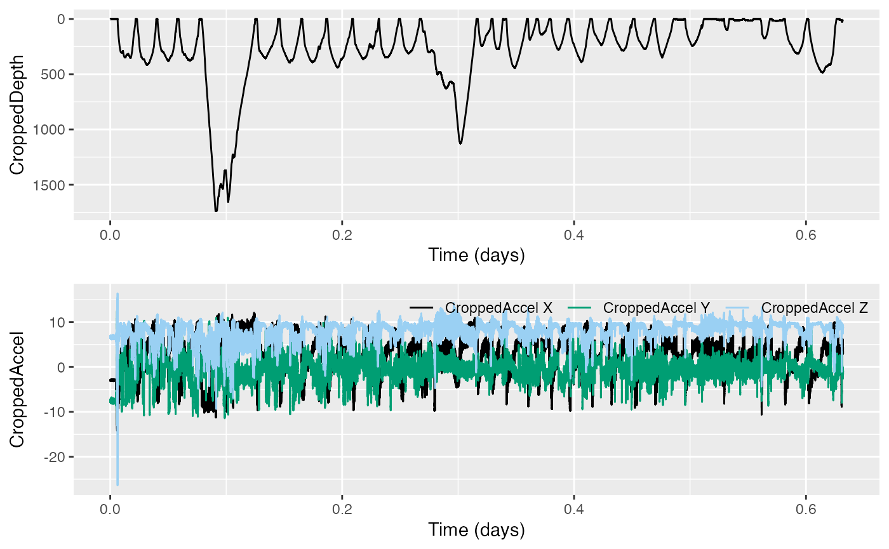

# Using dive_stats

Welcome to this vignette! On behalf of the team behind tagtools, thanks
for taking some time to get to know our package. We hope it sparks joy.

In this vignette you will learn to use the function `dive-stats` to
compute summary statistics for a given dataset containing dives,
including adding an auxiliary variable.

*Estimated time for this vignette: 25 minutes.*

These practicals all assume that you have R/Rstudio, some basic
experience working with them, and can execute provided code, making some
user-specific changes along the way (e.g. to help R find a file you
downloaded). We will provide you with quite a few lines. To boost your
own learning, you would do well to try and write them before opening
what we give, using this just to check your work.

Additionally, be careful when copy-pasting special characters such as
\_underscores\_ and ‘quotes’. If you get an error, one thing to check is
that you have just a single, simple underscore, and `'straight quotes'`,
whether `'single'` or `"double"` (rather than “smart quotes”).

## Finding dives and summarising them

Consider a dataset from a DTAG attached to a Cuvier’s beaked whale,
*Ziphius cavirostris*. Load the data from file zc11_267a.nc. If you want
to run this example, download the “zc11_267a.nc” file from
<https://github.com/animaltags/tagtools_data> and change the file path
to match where you’ve saved the files

``` r
library(tagtools)
ZC_file_path <- "nc_files/zc11_267a.nc"
ZC <- load_nc(ZC_file_path)
```

1.  Make a plot of the dive profile. What do you notice?

``` r
plott(X=list(Depth=ZC$P), r = TRUE)
```

Show/Hide Results/*Answers*



*There are some very deep dives in this profile! This is perhaps to be
expected for Cuvier’s beaked whales, with their reputation for
mysteriously extreme excursions.*

2.  You probably want to crop the data before further analysis, because
    there is a period at the start of the recording when the tag was not
    yet deployed on the whale.

``` r
ZPCr = crop(ZC$P)
# if you want to review history/other fields
str(ZPCr, max.level = 1)
```

Show/Hide Results

    #> [1] "Results for `crop(ZC$P)`:"
    #> [1] "---------------------------------------"


    #> [1] "Position your cursor and then click once followed by clicking FINISH to change the start, or click twice in the same spot followed by clicking FINISH to change the end. If you wish to change both the start and end click once at the start time desired and twice at the end time desired."
    #> [1] "Results for `str(ZPCr, max.level = 1)`:"
    #> [1] "---------------------------------------"
    #> List of 18
    #>  $ data              : num [1:330359(1d)] 2.15 2.13 2.16 2.16 2.13 ...
    #>  $ sampling          : chr "regular"
    #>  $ sampling_rate     : num 5
    #>  $ sampling_rate_unit: chr "Hz"
    #>  $ depid             : chr "zc11_267a"
    #>  $ creation_date     : chr "2017-08-08 04:55:39"
    #>  $ history           : chr "sens_struct"
    #>  $ type              : chr "P"
    #>  $ full_name         : chr "Depth"
    #>  $ description       : chr "dive depth"
    #>  $ unit              : chr "m H2O"
    #>  $ unit_name         : chr "meters H2O (salt)"
    #>  $ unit_label        : chr "meters"
    #>  $ start_offset      : num 0
    #>  $ start_offset_units: chr "second"
    #>  $ column_name       : chr ""
    #>  $ frame             : chr ""
    #>  $ axes              : chr "D"

3.  What minimum depth threshold do you think you would use to detect
    dives this animal’s dives? Consider how you would justify your
    choice.

*Show/Hide Answers*

*No less than fifty meters seems like a reasonable choice to detect this
animal’s dives. After all, most of the dives this animal performs are
more than 100 meters in depth.*

4.  Use `find_dives` to detect all dives deeper than your chosen minimum
    depth `mindepth`.

``` r
mindepth <- # your chosen minimum depth here
dt <- find_dives(ZPCr, mindepth=mindepth) 
```

Going forward, the code will have assumed a minimum depth of $`50 m`$.

5.  Now use `dive_stats` to compute summary statistics for all the dives
    you detected.

``` r
ds <- dive_stats(ZPCr, dive_cues=dt[,c('start', 'end'),]) 
str(ds)
```

Show/Hide Results

    #> 'data.frame':    25 obs. of  12 variables:
    #>  $ num      : int  1 2 3 4 5 6 7 8 9 10 ...
    #>  $ max      : num  1737 356 395 391 438 ...
    #>  $ st       : num  6728 10925 12624 14304 16177 ...
    #>  $ et       : num  10806 12510 14230 16091 18027 ...
    #>  $ dur      : num  4078 1585 1606 1787 1850 ...
    #>  $ dest_st  : num  7698 11212 13093 14768 16636 ...
    #>  $ dest_et  : num  8954 11802 13705 15391 17170 ...
    #>  $ dest_dur : num  1255 590 612 623 534 ...
    #>  $ to_dur   : num  970 287 469 465 459 ...
    #>  $ from_dur : num  1852 709 525 700 857 ...
    #>  $ to_rate  : num  1.521 1.055 0.715 0.714 0.809 ...
    #>  $ from_rate: num  -0.797 -0.426 -0.638 -0.473 -0.434 ...

6.  Have a look at the dive stats and perhaps make a plot of some or all
    of them. Do you notice anything interesting?

### Optional: choose an extra variable

7.  Choose an auxiliary variable (could be anything of interest - pitch,
    roll, heading, MSA, ODBA, njerk…).

Compute the auxiliary variable, and then recompute the dive stats
including the auxiliary variable.

*One example auxiliary variable—pitch—is given below.*

#### Compute pitch

The function `a2pr` will calculate pitch and roll from acceleration. To
use the acceleration data, we’ll want it cropped to the same time window
as we’ve cropped the depth data.

``` r
ZACr <- crop_to(ZC$A, tcues = ZPCr$crop)
# plot to confirm the cropping

plott(X=list(CroppedDepth=ZPCr, CroppedAccel=ZACr), 
      r=c(TRUE,FALSE)) # and reverse the y-axis for depth, but not acceleration 
```

Show/Hide Results



And now to compute pitch:

``` r
ZPiCr <- a2pr(ZACr)$p # this is the variable you'll want to use later
```

#### Recompute dive stats

Use the auxiliary variable of your choice (if you were following the
example above, you’ll use ZPiCr) for my_aux_var.

``` r
dsAux <- dive_stats(P = matrix(ZPCr$data), sampling_rate = ZPCr$sampling_rate, dive_cues=dt[,c('start', 'end'),], X=matrix(my_aux_var))
# if you are using ZPiCr
dsAux <- dive_stats(P = matrix(ZPCr$data), 
                    dive_cues=dt[,c('start', 'end'),], 
                    X = matrix(ZPiCr), # to avoid nrow != ncol errors
                    angular = TRUE, # because this is pitch angle data
                    sampling_rate = c(5, 5) # sampling rate is 5 for P & X
                    )
```

8.  Examine and/or plot again.

``` r
str(ds, max.level = 1)
str(dsAux, max.level = 1) 
plott( # ... figure out what you want to plott; results not shown for this part
  )
```

Show/Hide Results

    #> [1] "Results for `str(ds, max.level = 1):`"
    #> [1] "-----------------------------------------"
    #> 'data.frame':    25 obs. of  12 variables:
    #>  $ num      : int  1 2 3 4 5 6 7 8 9 10 ...
    #>  $ max      : num  1737 356 395 391 438 ...
    #>  $ st       : num  6728 10925 12624 14304 16177 ...
    #>  $ et       : num  10806 12510 14230 16091 18027 ...
    #>  $ dur      : num  4078 1585 1606 1787 1850 ...
    #>  $ dest_st  : num  7698 11212 13093 14768 16636 ...
    #>  $ dest_et  : num  8954 11802 13705 15391 17170 ...
    #>  $ dest_dur : num  1255 590 612 623 534 ...
    #>  $ to_dur   : num  970 287 469 465 459 ...
    #>  $ from_dur : num  1852 709 525 700 857 ...
    #>  $ to_rate  : num  1.521 1.055 0.715 0.714 0.809 ...
    #>  $ from_rate: num  -0.797 -0.426 -0.638 -0.473 -0.434 ...
    #> [1] "Results for `str(dsAux, max.level = 1):`"
    #> [1] "-----------------------------------------"
    #> 'data.frame':    25 obs. of  20 variables:
    #>  $ num            : int  1 2 3 4 5 6 7 8 9 10 ...
    #>  $ max            : num  1737 356 395 391 438 ...
    #>  $ st             : num  6728 10925 12624 14304 16177 ...
    #>  $ et             : num  10806 12510 14230 16091 18027 ...
    #>  $ dur            : num  4078 1585 1606 1787 1850 ...
    #>  $ dest_st        : num  7698 11212 13093 14768 16636 ...
    #>  $ dest_et        : num  8954 11802 13705 15391 17170 ...
    #>  $ dest_dur       : num  1255 590 612 623 534 ...
    #>  $ to_dur         : num  970 287 469 465 459 ...
    #>  $ from_dur       : num  1852 709 525 700 857 ...
    #>  $ to_rate        : num  1.521 1.055 0.715 0.714 0.809 ...
    #>  $ from_rate      : num  -0.797 -0.426 -0.638 -0.473 -0.434 ...
    #>  $ mean_angle     : num  0.3 0.369 0.327 0.346 0.338 ...
    #>  $ angle_var      : num  0.3087 0.0978 0.113 0.0972 0.0784 ...
    #>  $ mean_to_angle  : num  -0.85 -0.356 -0.252 -0.201 -0.201 ...
    #>  $ mean_dest_angle: num  0.209 0.348 0.345 0.378 0.337 ...
    #>  $ mean_from_angle: num  0.832 0.635 0.782 0.673 0.606 ...
    #>  $ to_angle_var   : num  0.0763 0.1025 0.0737 0.0446 0.0565 ...
    #>  $ dest_angle_var : num  0.2638 0.0326 0.0264 0.0195 0.022 ...
    #>  $ from_angle_var : num  0.0398 0.0245 0.0139 0.0581 0.0186 ...

## Review

You’ve learned a couple of ways to use `dive-stats`. Well done!

*If you’d like to continue working through these practicals, consider
`rotation-test` or `fine-scale-tracking` .*

``` r
vignette('rotation-test')
vignette('fine-scale-tracking')
```

------------------------------------------------------------------------

Animaltags tag tools online: <http://animaltags.org/>,
<https://github.com/animaltags/tagtools_r> (for latest beta source
code), <https://animaltags.github.io/tagtools_r/index.html> (vignettes
overview)
