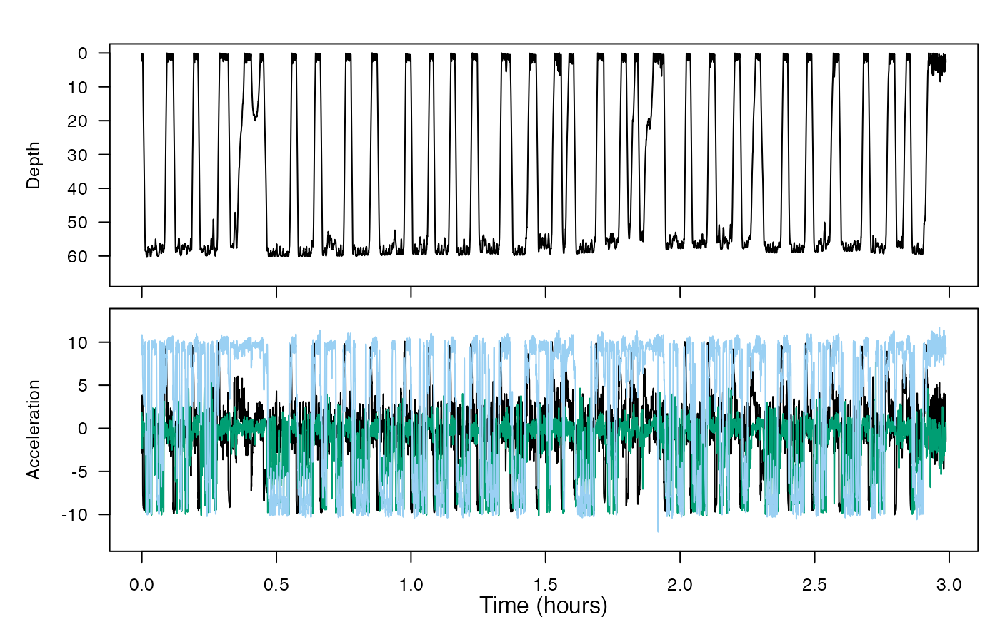
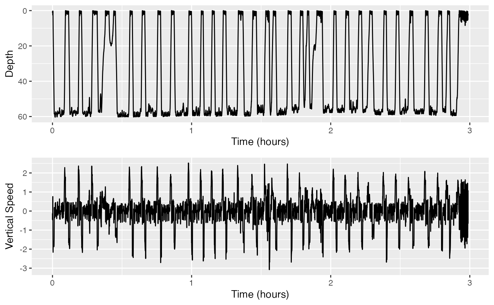
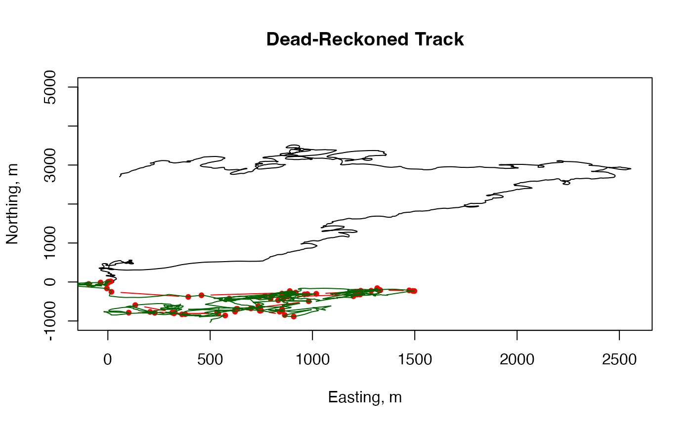
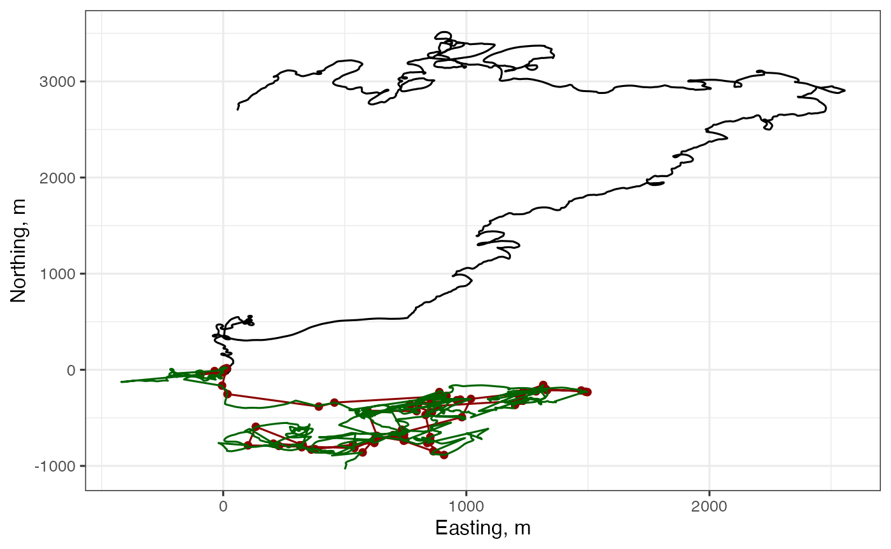
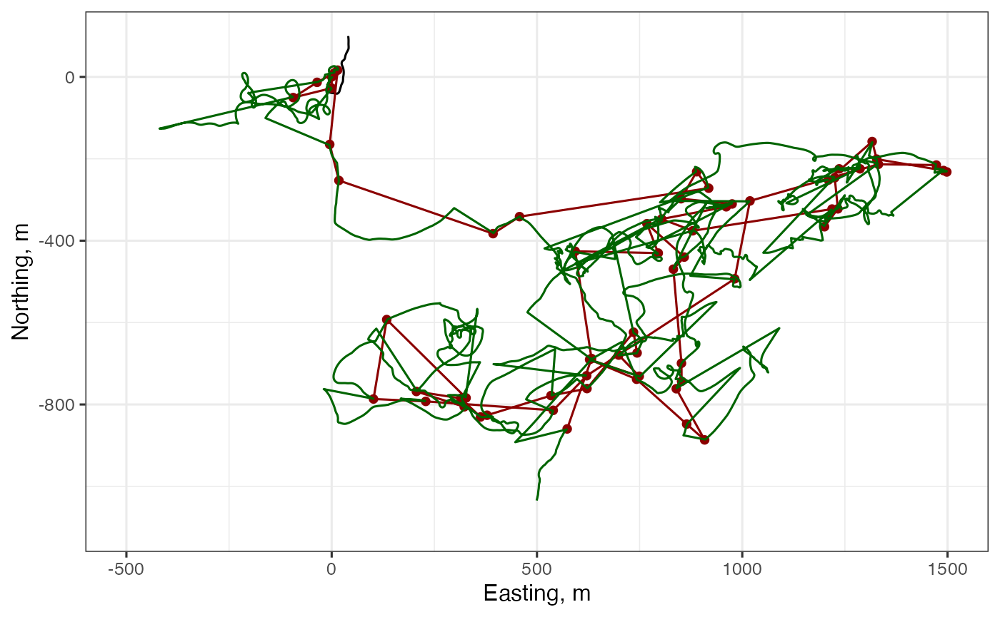
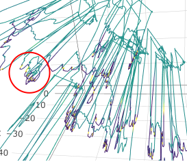

# Fine-scale tracking

Welcome to the `fine-scale-tracking` vignette! Thanks for taking some
time to get to know our package; we hope it sparks joy.

This practical covers how to compute a dead-reckoned track from
accelerometer and magnetometer data and compares this track estimate to
GPS positions that were taken by the tag. This illustrates both the high
resolution of dead-reckoned tracks and the **very** large errors that
can accumulate. You will then explore how to merge the GPS and
dead-reckoned tracks to produce a high-resolution track with lower error
and try visualizing the track coloured by another parameter.

*Estimated time for this vignette: 40 minutes.*

These practicals all assume that you have R/Rstudio installed on your
machine, some basic experience working with them, and can execute
provided code, making some user-specific changes along the way (e.g. to
help R find a file you downloaded). We will provide you with quite a few
lines. To boost your own learning, you would do well to try and write
them before opening what we give, using this just to check your work.

Additionally, be careful when copy-pasting special characters such as
\_underscores\_ and ‘quotes’. If you get an error, one thing to check is
that you have just single, simple underscores, and `'straight quotes'`,
whether `'single'` or `"double"` (rather than “smart quotes”).

## Load and Explore Data

If you want to run this example, download the “testset7.nc” file from
<https://github.com/animaltags/tagtools_data> and change the file path
to match where you’ve saved the files

Load the data set `testset7.nc`. This dataset is built into the
`tagtools` package, so you can access it using `system.file`.

Then, check the contents of the data structures to answer the following
questions. (See the code below if and only if you need a hint.)

- What species did the data come from, and where did the data come from?

*Show/Hide Answers*

*A humpback whale,* Megaptera novaeangliae*.*

- What is the sampling rate of the accelerometer data?

*Show/Hide Answers*

*1 Hz.*

- What processing steps have already been applied to the magnetometer
  data?

*Show/Hide Answers*

*sens_struct, do_cal, tag2animal, crop_to, decdc(5)… So, it has been
converted to a sensor structure, calibrated, put into the animal frame,
cropped to a certain segment of data, and decimated by a factor of five
(as a result, the sampling rate is now the same as the acceleration
data, 1 Hz).*

- What is in the 3 columns in the POS (GPS position) data?

*Show/Hide Answers*

*The three columns are the time, the latitude, and the longitude.*

- Which frame is the accelerometer data in? Which frame is the
  magnetometer data in?

*Show/Hide Answers*

*The accelerometer data is oriented in the animal frame, and so is the
magnetometer data.*

``` r
str(d7$info, max.level = 1)
#> List of 35
#>  $ depid                        : chr "mn18_175d"
#>  $ dtype_source                 : chr "mn18_175d001,mn18_175d002,mn18_175d003,mn18_175d004,mn18_175d005,mn18_175d006,mn18_175d007,mn18_175d008,mn18_17"| __truncated__
#>  $ dtype_datetime_made          : chr "2018/07/05 15:25:29"
#>  $ dtype_nfiles                 : num 18
#>  $ dtype_format                 : chr "DTG"
#>  $ device_serial                : num 1.88e+09
#>  $ device_make                  : chr "DTAG"
#>  $ device_type                  : chr "Archival"
#>  $ device_model                 : chr "DTAG4"
#>  $ device_url                   : chr "https://www.soundtags.org"
#>  $ sensors_firm                 : chr "Not specified"
#>  $ sensors_soft                 : chr "Not specified"
#>  $ sensors_list                 : chr "3axis Accelerometer,3 axis Magnetometer,Pressure,GPS,Sound"
#>  $ animal_id                    : chr "Unknown"
#>  $ animal_species_common        : chr "Humpback whale"
#>  $ animal_species_science       : chr "Megaptera novaeangliae"
#>  $ animal_dbase_url             : chr "http://www.arkive.org/humpback-whale/megaptera-novaeangliae/"
#>  $ dephist_device_tzone         : chr "0"
#>  $ dephist_device_regset        : chr "yyyy/mm/dd HH:MM:SS"
#>  $ dephist_device_datetime_start: chr "2018/06/24 11:14:24"
#>  $ dephist_deploy_locality      : chr "Cape Cod, Massachusetts"
#>  $ dephist_deploy_location_lat  : chr ""
#>  $ dephist_deploy_location_lon  : chr ""
#>  $ dephist_deploy_datetime_start: chr "2018/06/24 11:14:24"
#>  $ dephist_deploy_method        : chr "suction cup"
#>  $ project_name                 : chr "ONR Tag Design"
#>  $ project_datetime_start       : chr ""
#>  $ project_datetime_end         : chr ""
#>  $ provider_name                : chr "Susan Parks"
#>  $ provider_details             : chr "Univ Syracuse"
#>  $ provider_email               : chr "sparks@syr.edu"
#>  $ provider_license             : chr "Contact data provider"
#>  $ provider_cite                : chr "Contact data provider"
#>  $ provider_doi                 : chr "Contact data provider"
#>  $ creation_date                : chr "06-Dec-2019 10:34:49"
str(d7$Aa, max.level = 1)
#> List of 23
#>  $ data              : num [1:10756, 1:3] -0.725 -1.73 -1.221 -1.632 -2.85 ...
#>  $ sampling          : chr "regular"
#>  $ sampling_rate     : num 1
#>  $ sampling_rate_unit: chr "Hz"
#>  $ depid             : chr "mn18_175d"
#>  $ creation_date     : chr "09-Jul-2018 12:06:55"
#>  $ history           : chr "sens_struct,do_cal,tag2animal,crop_to,decdc(5)"
#>  $ type              : chr "acc"
#>  $ full_name         : chr "Acceleration"
#>  $ description       : chr "triaxial acceleration"
#>  $ unit              : chr "m/s2"
#>  $ unit_name         : chr "metres per second squared"
#>  $ unit_label        : chr "m/s^2"
#>  $ start_offset      : num 0
#>  $ start_offset_units: chr "seconds"
#>  $ column_name       : chr "x,y,z"
#>  $ frame             : chr "animal"
#>  $ axes              : chr "FRU"
#>  $ cal_poly          : num [1:6] 77.4183 77.7662 77.7547 -0.0921 -0.0762 ...
#>  $ cal_map           : num [1:9] 0 -1 0 -1 0 0 0 0 1
#>  $ otab              : num [1:5] 0 0 -0.855 0.157 1.902
#>  $ crop              : num [1:2] 91265 102021
#>  $ crop_units        : chr "seconds"
str(d7$POS, max.level = 1)
#> List of 20
#>  $ data              : num [1:63, 1:3] 0.827 12.058 338.364 698.659 738.046 ...
#>  $ sampling          : chr "irregular"
#>  $ sampling_time     : chr "column 1"
#>  $ sampling_time_unit: chr "second"
#>  $ depid             : chr "mn18_175d"
#>  $ creation_date     : chr "05-Jul-2018 15:25:54"
#>  $ history           : chr "sens_struct,crop_to"
#>  $ type              : chr "pos"
#>  $ full_name         : chr "Position"
#>  $ description       : chr "GPS position"
#>  $ unit              : chr "degrees"
#>  $ unit_name         : chr "decimal degrees"
#>  $ unit_label        : chr "degrees"
#>  $ start_offset      : num 0
#>  $ start_offset_units: chr "seconds"
#>  $ column_name       : chr "time,lat,long"
#>  $ frame             : chr "WGS84"
#>  $ axes              : chr "NE"
#>  $ crop              : num [1:2] 91265 102021
#>  $ crop_units        : chr "seconds"
```

Plot the pressure and accelerometer data with
[`plott()`](https://animaltags.github.io/tagtools_r/reference/plott.md)
to get a sense for what the animal might be doing in this data segment.
Note that the code example below assumes you have called the data set
`d7`:

``` r
library(tagtools)
d7_file_path <- ""
d7 <- load_nc(d7_file_path)
sampling_rate <- d7$P$sampling_rate
plott(X = list(Depth = d7$P, Acceleration = d7$Aa), fsx = sampling_rate, interactive = TRUE)
```

Show/Hide Results



Then, plot the GPS positions:

``` r
plot(d7$POS$data[,3], d7$POS$data[,2], type = 'b', pch = 20)
```

Show/Hide Results


## Dead-reckoning

### What is Dead-reckoning?

Hearken back to your earliest trigonometry course. Chances are, you used
angles and distances to calculate other distances (on a right triangle,
especially). Then, in calculus, you’ve probably used angles and rates of
change to calculate distance or other rates of change. Dead-reckoning is
essentially this—using just a heading and a forward speed in order to
plot a forward path. The technique is fairly commonplace in sailing and
aviation, and can be made accurate with the help of known position data.
If you want more background, consult [this
video](https://www.youtube.com/watch?v=doZ1k1Oeeh8) for an example with
some simple trigonometry.

However, per
[Wikipedia](https://en.wikipedia.org/wiki/Dead_reckoning#Errors) (which
simply says it very well), dead-reckoning “is subject to significant
errors of approximation. For precise positional information, both speed
and direction must be accurately known at all times during travel. Most
notably, dead reckoning does not account for directional drift during
travel through a fluid medium. These errors tend to compound themselves
over greater distances”. We will see how this is true over the course of
this vignette—water is seldom entirely still, and there is quite a
current present in the data we will soon investigate.

### Why use Dead-reckoning?

The plot shows a mix of intensive and extensive movements, but the
constraint of only getting positions when the animal is at the surface
means we cannot infer much about the movement behaviour within dives.
Dead-reckoning from accelerometer and magnetometer data is the only way
to estimate movement within dives without requiring external tracking
infrastructure.

### Estimating Animal Speed

Dead-reckoning uses the accelerometer and magnetometer to calculate the
direction of travel. In what frame do these data need to be?

*Show/Hide Answers*

*They both need to be in the animal frame. Thankfully, they both already
are!*

An estimate of the forward speed is also required. We don’t have a speed
sensor—doing this would actually be quite cumbersome, as compared to an
acceleration sensor. Nevertheless, we can compute the vertical speed
(i.e., the differential of the depth) during descents and ascents, which
might be a good starting guess:

``` r
v <- depth_rate(d7$P)
plott(X = list(Depth = d7$P$data, `Vertical Speed` = v), 
      fsx = sampling_rate)
```

Show/Hide Results



Set `interactive = TRUE` and zoom in to individual dives on this plot to
get a rough idea of the descent and ascent speed of the whale.

``` r
plott(X = list(Depth = d7$P$data, `Vertical Speed` = v), 
       fsx = sampling_rate, 
      interactive = TRUE)
```

Show/Hide Results

### Computing a Dead-Reckoned Track

Call your speed estimate speed `spd` and use it in the following line to
compute the dead-reckoned track:

``` r
spd <- #???? (fill in your estimate here)
DR <- ptrack(A = d7$Aa, M = d7$Ma, s = spd)
plot(DR$easting, DR$northing, type = 'l',
     xlab = 'Easting, m', ylab = 'Northing, m',
     main = 'Dead-Reckoned Track')
```

Show/Hide Results


A dead-reckoned track is a series of distances north (or south if
negative) and east (or west if negative) of the starting point which is
position (0, 0) in the plot. The first two columns of DR are these
‘northing’ and ‘easting’ values. The DR track is defined in a Local
Level Frame (LLF) as opposed to latitude and longitude. An LLF is like a
map—a region that is small enough that we can assume the earth is
flat—centered on the starting point.

**How does the spatial resolution of the dead-reckoned track look
compared to the surface GPS positions?**

*Show/Hide Answers*

*At first glance, the shape is quite similar, so this might not concern
us yet. Also, the spatial resolution looks much, much better! So, making
this track seems like a good idea.*

### Adding GPS positions

To plot the GPS positions on the same plot, we need to first convert
them into the same LLF. The first GPS position is only 0.8s into the
dataset (this is `\$d7\$POS\$data[1,1]`) so we can say that the
dead-reckoned track starts from this point. To convert latitude and
longitude into the LLF use:

``` r
POSLLF <- lalo2llf(trk = d7$POS$data[,c(2:3)])
plot(DR$easting, DR$northing, type = 'l',
     xlab = 'Easting, m', ylab = 'Northing, m',
     main = 'Dead-Reckoned Track',
     yl = c(-1000, 5000))
lines(POSLLF$easting, POSLLF$northing, type = 'b', col = 'red', pch = 20)
```

Show/Hide Results


How well does the dead-reckoned track match up to the GPS positions?

*Show/Hide Answers*

*They do not match up much at all. They touch at the beginning… and
that’s about it. After that, the shapes are somewhat preserved, but the
predicted track is way farther north, and quite a ways farther east,
than the actual known positions.*

The dead-reckoned track is always computed with respect to the water,
not the ground, but we are plotting it here with respect to the ground.
A more accurate track would take into account the water current. Can you
imagine what current direction would be needed to make the dead-reckoned
track more closely match the GPS positions?

*Show/Hide Answers*

*The current would need to be moving quite a bit south, and also some
distance west, in order to compensate for the large errors we are
seeing.*

There are a number of ways to combine the GPS positions and the
dead-reckoned track into a single track which has both the absolute
accuracy of GPS and the high temporal resolution of dead-reckoning. A
simple method is to force the dead-reckoned track to meet the GPS
positions at each surfacing by adding a constant ‘current’ to each track
point in the preceding dive. This is done by `fit_tracks`:

``` r
FT <- fit_tracks(P = POSLLF, times = d7$POS$data[,1],
                D = DR[,c(1:2)],
                sampling_rate = d7$Aa$sampling_rate)
# add to plot
plot(DR$easting, DR$northing, type = 'l',
     xlab = 'Easting, m', ylab = 'Northing, m',
     main = 'Dead-Reckoned Track',
     yl = c(-1000, 5000))
lines(POSLLF$easting, POSLLF$northing, type = 'b', col = 'red', pch = 20)

lines(FT$easting, FT$northing, col = 'darkgreen')       
```

Show/Hide Results



### A digression about graphics

**Skip to the next section if you’re not interested in improving the
plots.**

If you are interested in a nicer, zoomable plot and either have, or are
willing to install, packages `ggformula` and `plotly`, give the
following a try!

``` r
# if you need to install:
# install.packages(pkgs = c('ggformula', 'plotly'))
library(ggformula)
library(plotly)
theme_set(theme_bw(base_size = 12))

track_fig <- gf_path(northing ~ easting, data = DR,
         xlab = 'Easting, m', ylab = 'Northing, m') |>
  gf_path(northing ~ easting, data = POSLLF, color = 'darkred') |>
  gf_point(northing ~ easting, data = POSLLF, color = 'darkred') |>
  gf_path(northing ~ easting, data = FT, color = 'darkgreen')

track_fig
```

Show/Hide Results

    #> Loading required package: ggplot2
    #> Loading required package: scales
    #> Loading required package: ggiraph
    #> Loading required package: ggridges
    #> 
    #> New to ggformula?  Try the tutorials: 
    #>  learnr::run_tutorial("introduction", package = "ggformula")
    #>  learnr::run_tutorial("refining", package = "ggformula")
    #> 
    #> Attaching package: 'plotly'
    #> The following object is masked from 'package:ggplot2':
    #> 
    #>     last_plot
    #> The following object is masked from 'package:stats':
    #> 
    #>     filter
    #> The following object is masked from 'package:graphics':
    #> 
    #>     layout



OK, that’s the track figure. What about zooming and interaction?

``` r
track_fig |> ggplotly()
```

Show/Hide Results

Ahhh, so much nicer! But do note that
[`plotly()`](https://rdrr.io/pkg/plotly/man/plotly.html) figures render
only in interactive R sessions or, if using Rmarkdown, in html output
(not PDF).

This figure is also nicer in that we can update it by chaining. For
example, to change the axis limits:

``` r
track_fig_zoom <- track_fig |>
  gf_lims(x = c(-500, 1500), y = c(-1100, 100))
track_fig_zoom
```

Show/Hide Results

    #> Warning: Removed 10610 rows containing missing values or values outside the scale range
    #> (`geom_path()`).



### Interpreting the Tracks

**Now, back to the main tutorial…**

Examine the plot to see how the green fitted track interpolates the red
GPS positions. If the green track is to be believed, how effectively do
the surface positions capture the movement of the animal?

*Show/Hide Answers*

*They don’t capture the movement of the animal very well. So much
happens between the positions that we’re able to collect at the surface,
so we are missing out if surface positions is all we collect/show.*

## Tracks Colored by a Variable

We often want to plot a track colored proportional to another variable
of interest. For example, it can be useful to see where the animal is
diving along the track. Here is one way to color the track by dive
depth:

``` r
CF <- ggplot2::ggplot(FT) +
  ggplot2::geom_path(ggplot2::aes(y = northing, 
                                  x = easting,
                                  color = d7$P$data))
CF
```

Show/Hide Results

``` r
CF <- ggplot2::ggplot(FT) +
  ggplot2::geom_path(ggplot2::aes(y = northing, 
                                  x = easting,
                                  color = d7$P$data))
CF
```

–\> What about an interactive version?

``` r
plotly::ggplotly(CF)
```

Zoom in to see what the scale is of the track
[tortuosity](https://en.wikipedia.org/wiki/Tortuosity): Is there
tortuosity within individual dives, or is the tortuosity occurring
across dives?

*Show/Hide Answers*

*While most of the tortuosity occurs across dives, there is some
tortuosity within dives as well. The following picture comes from the
next chunk of code.* 

If you are done and want a challenge, try colouring the track by the
absolute roll angle instead of the depth. You could use col_line3 to
plot the 3-d positions (i.e., `FT$easting`, `FT$northing`, and
`d7\$P\$data`), and then colour the plot by absolute roll angle
remembering to convert from radians to degrees.

``` r
pitch_roll <- a2pr(d7$Aa)
roll_deg <- pitch_roll$r/pi*180
col_line3(x = FT$easting, y = FT$northing, 
          z = d7$P$data, c = roll_deg)
```

Show/Hide Results

## Review

What have you learned? What you can get out of—despite what problems can
arise from—dead-reckoning.

And that’s it! Fantastic work with this vignette.

*If you’d like to continue working through these vignettes, you could
take a stab at `find-dives` or `dive-stats`. These deal with the
functions find_dives and dive_stats, respectively.*

``` r
vignette('find-dives')
vignette('dive-stats')
```

------------------------------------------------------------------------

Animaltags tag tools online: <http://animaltags.org/>,
<https://github.com/animaltags/tagtools_r> (for latest beta source
code), <https://animaltags.github.io/tagtools_r/index.html> (vignettes
overview)
