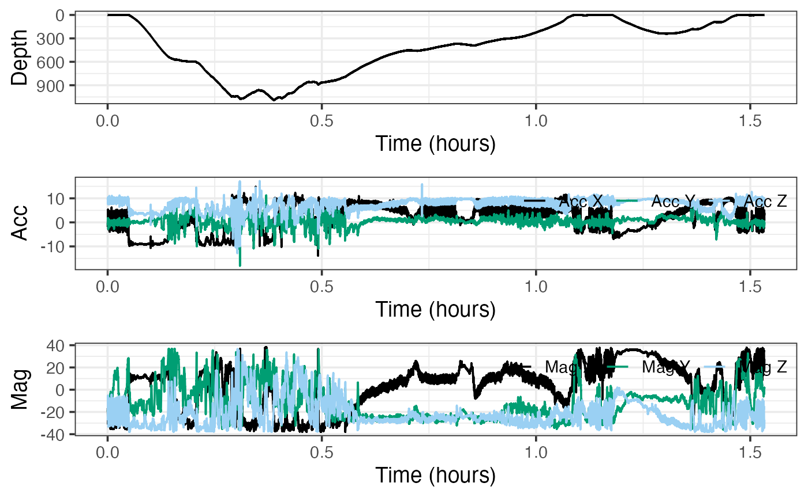
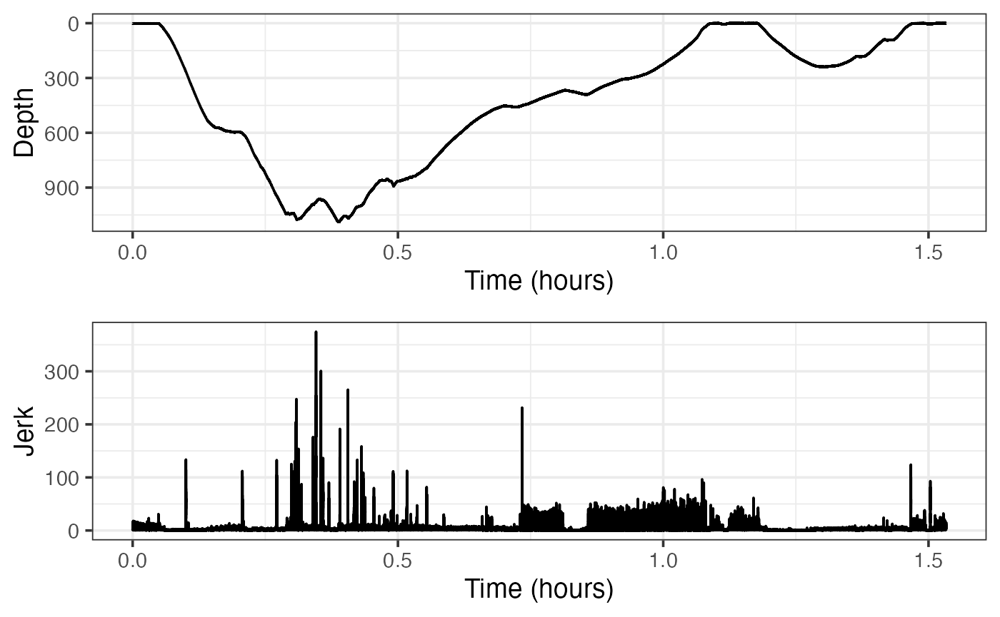
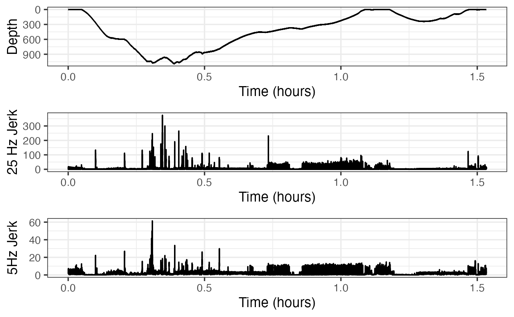
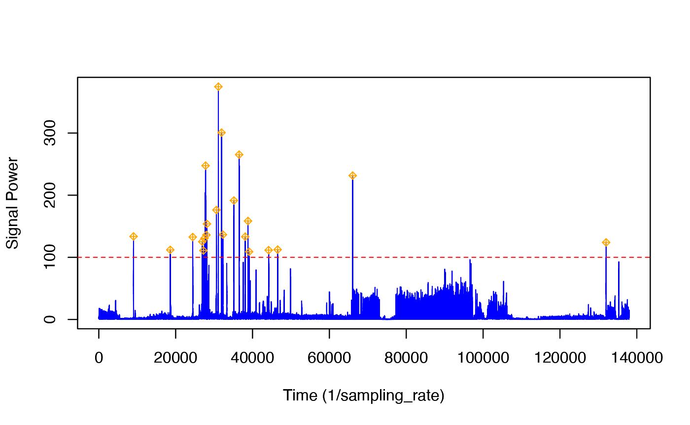
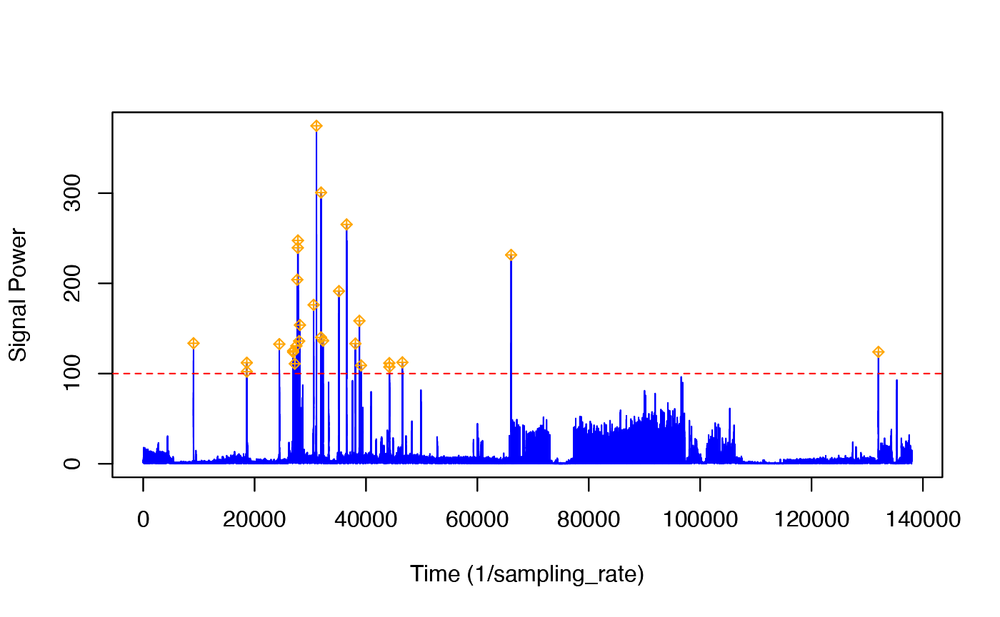
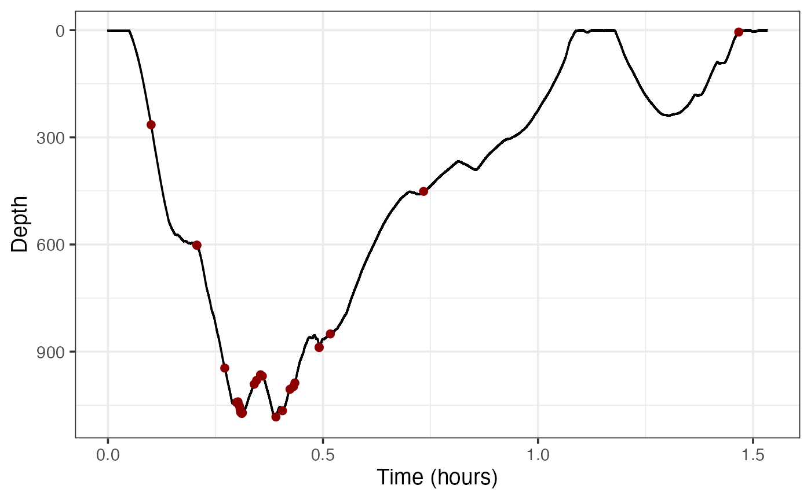

# Jerk: a way to emphasize rapid changes in acceleration

Welcome to the jerk-transients vignette! Thanks for getting some time to
know our package. We hope it’s, thus far, all you’ve dreamed it would
be.

In this vignette, you will use jerk to identify prey capture attempts.

*Estimated time for this vignette: 20 minutes.*

These practicals all assume that you have R/Rstudio installed on your
machine, some basic experience working with them, and can execute
provided code, making some user-specific changes along the way (e.g. to
help R find a file you downloaded). We will provide you with quite a few
lines. To boost your own learning, you would do well to try and write
them before opening what we give, using this just to check your work.

Additionally, be careful when copy-pasting special characters such as
\_underscores\_ and ‘quotes’. If you get an error, one thing to check is
that you have just a single, simple underscore, and `'straight quotes'`,
whether `'single'` or `"double"` (rather than “smart quotes”).

## Setup

If you’ve finished `complementary-filtering` within the same R session,
skip to [Acceleration transients, jerk and dynamic
acceleration](#acceleration-transients-jerk-and-dynamic-acceleration).
If not, you’ll want to do this first section.

For this practical we will use data from a suction cup tag attached to
the back of a beaked whale. If you want to run this example, download
the “testset1.nc” file from
<https://github.com/animaltags/tagtools_data> and change the file path
to match where you’ve saved the files

Write `testset1.nc` to the object `bw`, for “beaked whale”. Then use
[`plott()`](https://animaltags.github.io/tagtools_r/reference/plott.md)
to get a look at it.

``` r
library(tagtools)
bw_file_path <- "nc_files/testset1.nc"
bw <- load_nc(bw_file_path)
plott(X = list(Depth = bw$P, Acc = bw$A, Mag = bw$M))
```

Show/Hide Results



This dataset contains a deep dive followed by a shallow dive. We want to
infer the function of these by looking for locomotion effort and sudden
changes in acceleration that could be indicative of prey capture
attempts. We are also going to look for changes in swimming gait.

## Acceleration transients, jerk and dynamic acceleration

We want to look for indications of foraging during the two dives. Sudden
changes (transients) in acceleration are often associated with prey
capture attempts. One way to emphasise rapid changes in acceleration is
by differentiating it to produce the jerk.

This is effectively high-pass filtering acceleration with a
constantly-sloping filter—the higher the frequency, the more it is
emphasised. Because we don’t know what kind of movement is involved in a
prey capture attempt, we don’t know which axis of acceleration will be
most relevant. It is safer then to just compute the magnitude of the
jerk in all three axes to get a single vector (also called “norm-jerk”).
That way, a peak in any or all axes will show up. `njerk` computes this
from acceleration. Try running `njerk` on our acceleration data (where
is it stored?) and writing the result to `J`. Then, once you also grab
the sampling rate, you can plot this jerk data.

``` r
J <- njerk(bw$A)
fs <- bw$A$sampling_rate
plott(X = list(Depth = bw$P$data, Jerk = J), fsx = fs)
```

Show/Hide Results



Where in the dive profile do the largest jerk transients (peaks) appear?

*Show/Hide Answers*

*The largest jerk transients appear mostly at the bottom of the deeper
dive.*

Check out some of the biggest peaks to see how short they are.

### Effects of Sampling Rate on jerk

The size and clarity of the jerk peaks depends on the sampling rate. We
are using 25 Hz data. To see what you would get with 5 Hz data, try
decimating the acceleration before computing the jerk:

``` r
str(bw$A, max.level = 1) # look at the data before decimation
Ad <- decdc(bw$A, 5) # decimate by 5 times. New sampling rate is 25/5 Hz
str(Ad, max.level = 1) # and after decimation
```

Show/Hide Results

    #> [1] "results for str(bw$A, max.level = 1)"
    #> [1] "------------------------------------"
    #> List of 18
    #>  $ data              : num [1:137976, 1:3] -1.85 -1.78 -1.73 -1.7 -1.64 ...
    #>  $ sampling          : chr "regular"
    #>  $ sampling_rate     : num 25
    #>  $ sampling_rate_unit: chr "Hz"
    #>  $ depid             : chr "md13_134a"
    #>  $ creation_date     : chr "30-Jul-2017 23:13:50"
    #>  $ history           : chr "sens_struct"
    #>  $ type              : chr "acc"
    #>  $ full_name         : chr "Acceleration"
    #>  $ description       : chr "triaxial acceleration"
    #>  $ unit              : chr "m/s2"
    #>  $ unit_name         : chr "meters per seconds squared"
    #>  $ unit_label        : chr "m/s^2"
    #>  $ start_offset      : num 0
    #>  $ start_offset_units: chr "second"
    #>  $ column_name       : chr "x,y,z"
    #>  $ frame             : chr "animal"
    #>  $ axes              : chr "FRU"
    #> [1] "results for str(Ad, max.level = 1)"
    #> [1] "------------------------------------"
    #> List of 18
    #>  $ data              : num [1:27595, 1:3] -1.797 -1.484 -0.965 -0.28 0.339 ...
    #>  $ sampling          : chr "regular"
    #>  $ sampling_rate     : num 5
    #>  $ sampling_rate_unit: chr "Hz"
    #>  $ depid             : chr "md13_134a"
    #>  $ creation_date     : chr "30-Jul-2017 23:13:50"
    #>  $ history           : chr "decdc(5)"
    #>  $ type              : chr "acc"
    #>  $ full_name         : chr "Acceleration"
    #>  $ description       : chr "triaxial acceleration"
    #>  $ unit              : chr "m/s2"
    #>  $ unit_name         : chr "meters per seconds squared"
    #>  $ unit_label        : chr "m/s^2"
    #>  $ start_offset      : num 0
    #>  $ start_offset_units: chr "second"
    #>  $ column_name       : chr "x,y,z"
    #>  $ frame             : chr "animal"
    #>  $ axes              : chr "FRU"

Compute the decimated jerk from the decimated acceleration, and plot it
with the jerk computed from the full bandwidth acceleration:

``` r
Jd <- njerk(Ad)
plott(X = list(Depth = bw$P$data, `25 Hz Jerk` = J, `5Hz Jerk` = Jd),
      fsx = c(fs, fs, fs/5))
```

Show/Hide Results



Check out some of the obvious peaks around minute 20 to minute 30 to
have a look at the ‘signal-to-noise’ in the jerk transients. How clear
are the jerk transients in the decimated signal compared to the original
data rate? What does this tell you about the frequency content in the
transients?

*Show/Hide Answers*

*The jerk transients are definitely less clear in the decimated signal
compared to the original data rate. Consider the peak near 0.75 hours in
the original (*25 Hz*)signal: there is no corresponding peak near 0.75
hours in the decimated signal. Similarly, consider the two peaks near
1.5 hours in the original. Though the jerk is higher around this area in
the decimated signal, the peaks are quite unclear. This tells us that it
is important to have high-resolution data—since the acceleration is
changing so quickly, it is possible to stop observing for just 0.2
seconds (as is true of* 5 Hz *data), and miss an important event.*

*Put concisely, the jerk signal has a lot of high frequency content.*

### Detecting Jerk Peaks

To find potential prey capture attempts, we need to run a detector on
the norm-jerk signal. Although it is easy to see peaks by eye in the
data, detectors require some information to do a good job: they need to
know the threshold above which a peak is really a peak and the blanking
time, i.e., the minimum time that must elapse after a detection before
another detection can happen.

The tagtools includes interactive peak detectors that allow you to
choose a threshold and see the effect this has on which transients are
detected. We will use a blanking time of 5s, i.e., we expect that the
shortest time between prey captures is 5s:

``` r
pks <- detect_peaks(J, fs, bktime = 5)  # 5s blanking time, threshold is interactive
```

Show/Hide Results

    #> GRAPH HELP:
    #> For changing only the thresh level, click once within the plot and then push enter
    #>  to specify the y-value at which your new thresh level will be.
    #> For changing just the bktime value, click twice within the plot and then push enter
    #>  to specify the length for which your bktime will be.
    #> To change both the bktime and the thresh, click three times within the plot:
    #>  the first click will change the thresh level,
    #>  the second and third clicks will change the bktime.
    #> To return your results without changing the thresh and bktime from their default
    #>  values, simply push enter.



Follow the instructions in the console to change the threshold. You need
to pick a threshold that excludes most of the jerk transients during the
strong propulsion locomotion in the ascent but that still detects most
of the jerk transients during the bottom part of the deep dive.
(Balancing false detections and missed detections is often not easy in a
detector and is a matter of finding a trade-off that works for your
application.) In the figure given, we’ve set the threshold to 100.

This function returns a list of information about the detected peaks.
For each detection, the start and end times are reported (in seconds),
along with the time at which the peak occurred and the height of the
peak. Finally, the selected threshold and blanking time are reported.
You can plot the height and time of each detection along with the dive
profile as follows:

``` r
plott(X = list(Depth = bw$P))
# note: the code below assumes your plott x-axis is in hours.
# if it were in minutes use /60 instead of /3600, etc.
points(pks$peak_time/fs/3600, bw$P$data[round(pks$peak_time)], pch = 8)
```

Show/Hide Results



Bearing in mind that some of the jerk peaks might come from strong
locomotory strokes, is there strong evidence for foraging in the deep
dive? Is there strong evidence for foraging in the shallow dive?

*Show/Hide Answers*

*Yes, there is strong evidence for foraging in the deep dive, since with
all the jerk peaks present there, there are likely some strong
locomotory strokes in it. These strong locomotory strokes are, in turn,
evidence of foraging. However, there is almost no evidence for foraging
in the shallow dive, since there are no jerk peaks there.*

Now, if you have done `complementary-filtering` recently, here is one
more question for you. Adding your inference from
`complementary-filtering` about locomotion in the shallow dive, what can
you conclude about the general behaviour of the animal in the shallow
dive? Namely, is it resting, traveling or foraging? Write down your
marvelous thoughts.

*Show/Hide Answers*

*We know now that the whale is likely not foraging in the shallow dive,
since the sudden movements (jerk peaks) are happening only in the
earlier dive. Additionally, though the animal is not accelerating
quickly (striking/flinching), it is still moving (locomotion). So it
seems more likely to be traveling than resting.*

## Review

You’ve learned how to accentuate quick movements of an animal using
jerk, and used the accentuated picture to gain understanding about the
animal’s behaviour.

And with that, congrats! You bounced through this vignette.

*If you’d like to continue working through these vignettes,
`acceleration-filtering` and `magnetometer-filtering` are very logical
choices. You’ll gain more insight into the same dataset, and other ways
of analysing locomotion, by doing these.*

``` r
vignette('acceleration-filtering')
vignette('magnetometer-filtering')
```

------------------------------------------------------------------------

Animaltags tag tools online: <http://animaltags.org/>,
<https://github.com/animaltags/tagtools_r> (for latest beta source
code), <https://animaltags.github.io/tagtools_r/index.html> (vignettes
overview)
