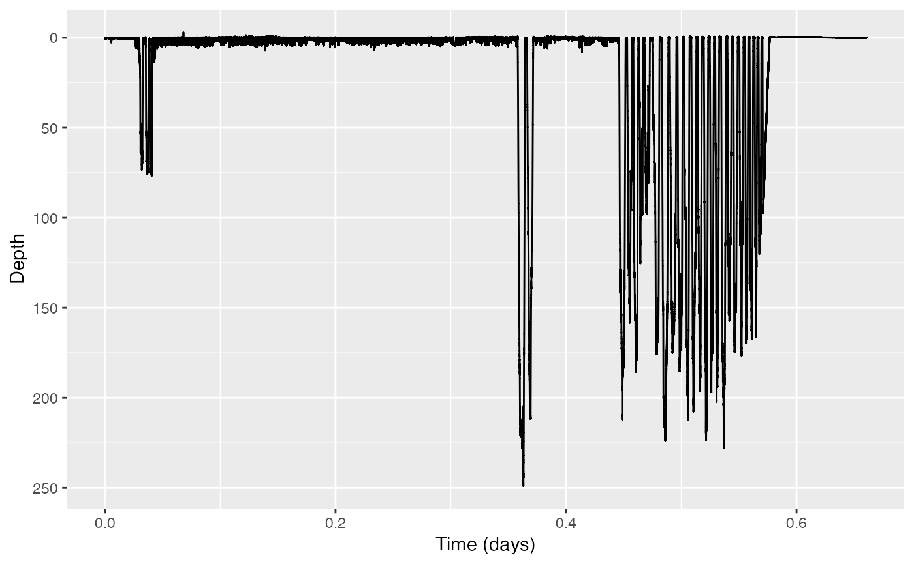

# Rotation test

Welcome to the `rotation-test` vignette! Thanks for getting to know our
package. We hope this dataset revives a sense of wonder somewhere in
your soul. In this vignette, you will use a rotation test to test
whether a certain hypothesis is actually meaningfully true.

*Estimated time for this vignette: 20 minutes.*

These practicals all assume that you have R/Rstudio, some basic
experience working with them, and can execute provided code, making some
user-specific changes along the way (e.g. to help R find a file you
downloaded). We will provide you with quite a few lines. To boost your
own learning, you would do well to try and write them before opening
what we give, using this just to check your work.

Additionally, be careful when copy-pasting special characters such as
\_underscores\_ and ‘quotes’. If you get an error, one thing to check is
that you have just a single, simple underscore, and `'straight quotes'`,
whether `'single'` or `"double"` (rather than “smart quotes”).

## Rotation test

We were very fortunate to obtain a number of test datasets from
different sources that we have permission to make publicly available
with the tag tool kit. One dataset (obtained from anonymous Scottish
contacts) is particularly exciting and possibly unique in the world: a
fragment of tag data obtained from a high-resolution movement tag
deployed on Nessie, the Loch Ness Monster.

Unfortunately several of the tag sensors malfunctioned, but we were able
to salvage some dive depth data to be used in this example. The dataset
is called `nessie.nc`. If you want to run this example, download the
“nessie.nc” file from <https://github.com/animaltags/tagtools_data> and
change the file path to match where you’ve saved the files

1.  Read in the data:

``` r
library(tagtools)
nessie_file_path <- "nc_files/nessie.nc"
nessie <- load_nc(nessie_file_path)
str(nessie, max.level = 1)
```

Show/Hide Results

    #> List of 2
    #>  $ P   :List of 16
    #>  $ info:List of 17
    #>  - attr(*, "class")= chr [1:2] "animaltag" "list"

And make a plot of the dive profile (because of course you want to see
it):

``` r
plott(X = list(Depth = nessie$P), interactive = TRUE)
```

Show/Hide Results



2.  According to some Scottish lore, Nessie surfaces more often in the
    hour around noon than during the rest of the day (because the glare
    on the water, and the lure of lunch, make it more difficult for
    people to spot her then). But does she really? Use find_dives to
    find start times for all her submergences, which we will use as a
    proxy for breath times. In this case, you will want to use a
    threshold that is as shallow as practicable.

``` r
th <- # ??? set a very shallow threshold
#find dives
dt <- find_dives(nessie$P, mindepth = th)
str(dt, max.level = 1)
```

Show/Hide Results

    #> 'data.frame':    3471 obs. of  4 variables:
    #>  $ start: num  0.52 0.64 0.84 1.2 1.48 1.6 1.76 1.88 2.12 2.24 ...
    #>  $ end  : num  0.6 0.72 0.92 1.28 1.56 1.68 1.84 1.96 2.2 2.32 ...
    #>  $ max  : num  0.601 0.606 0.622 0.615 0.615 ...
    #>  $ tmax : num  0.6 0.72 0.92 1.28 1.56 1.68 1.84 1.96 2.2 2.32 ...

3.  Do you think you could just use a regression model for surfacing
    rate to answer this question? Why or why not?

*Show/Hide Answers*

*No, because the data is autocorrelated? Uh,… because it’s just more
complicated?* **help pls**

4.  Use a rotation test to test whether the number of surfacings between
    11:30 and 12:30 is actually higher than you’d expect.

``` r
# make time variables
t_posix <- as.POSIXct(nessie$info$dephist_device_datetime_start, tz = 'GMT') + c(1:nrow(nessie$P$data))/nessie$P$sampling_rate
# find data times between 11:30 and 12:30
s <- as.POSIXct('2017-01-13 11:30:00', tz = 'GMT')
e <- as.POSIXct('2017-01-13 12:30:00', tz = 'GMT')
noon <- range(which(t_posix < e & t_posix > s)) 
#convert to seconds
noon <- noon/nessie$P$sampling_rate
#do test
RTR <- rotation_test(event_times = dt$start, exp_period = noon, full_period = c(0,length(nessie$P$data)/nessie$P$sampling_rate), n_rot = 10000, ts_fun = length)
```

Show/Hide Results

    #> $result
    #>   statistic CI_low CI_up n_rot conf_level   p_value
    #> 1       153      0   862 10000       0.95 0.7333267

5.  What can you conclude?

*Show/Hide Answers*

*Since the p-value is so high, it appears that Nessie does not, contrary
to popular belief, actually surface (significantly) more in the hour
between 11:30am and 12:30pm.*

And with that, great work! Now some of the mystery is forever gone… but
knowledge is power!

*If you’d like to continue working through these practicals, consider
`dive-stats`.*

``` r
vignette('dive-stats')
```

------------------------------------------------------------------------

Animaltags tag tools online: <http://animaltags.org/>,
<https://github.com/animaltags/tagtools_r> (for latest beta source
code), <https://animaltags.github.io/tagtools_r/index.html> (vignettes
overview)
